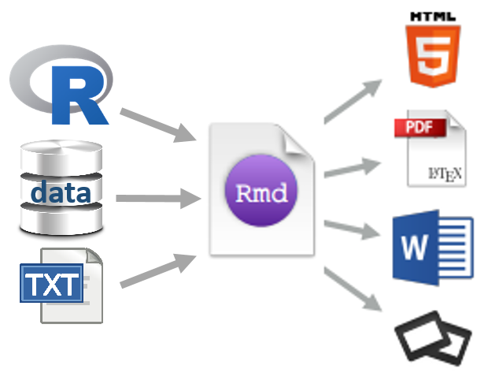

# reproducible research

ME497 / ME597 Reproducible Research. An introductory course for the R
novice by Richard Layton at Rose-Hulman Institute of Technology.

  - [About the course](cm/cm000_about-the-course.md)  
  - [Course index](cm/README.md)

<!-- - [Project due dates](cm/cm002a_deadlines.md)  -->

## week 0

*Course management*

  - [Calendar](cm/cm000_calendar.md) for an outline of our agendas and
    due dates
  - [Syllabus](cm/cm001_syllabus.md) for the outline of the course of
    study, policies, and procedures
  - [Getting help](cm/cm002b_getting-help.md)

*Reading assigments*

  - *Preface* pp. ix–xxv (physical copy) or
    [Introduction](http://r4ds.had.co.nz/introduction.html) (e-copy)  
  - [Calibration report](resources/readings/calibration-report.pdf)

*Software getting started*

  - [Install R and RStudio](cm/cm0010_install-R-RStudio.md). If you
    already use R and RStudio, please update R, RStudio, and packages to
    the most recent versions.
  - [Set up an R
    Project](https://github.com/DSR-RHIT/install-R-and-RStudio)  
  - Install the [tidyverse](https://www.tidyverse.org)  
  - [Setup Git and GitHub](cm/cm003_git-setup.md)

*Lecture slides*

  - [Course introduction](slides/slides001_introduction.pdf) \[slides
    001\]
  - [Software overview](slides/slides002_software.pdf) \[slides 002\]

*Project assignments*

  - [Project 3 getting started](cm/cm7301_project-3_start.md) ME 597
    students only

## week 1

*Project assignments*

  - [Project 1 getting started](cm/cm7101_project-1_start.md)

## week 2

## week 3

## week 4

## week 5

## week 6

## week 7

## week 8

## week 9

## week 10

*Course management*

*Reading assigments*

*File management*

*Data*

*Analysis*

*Graphs*

*Tutorials*

*Project assignments*

*Reporting*

*Lecture
slides*

<!-- ## week 1 -->

<!-- Reading: Chapters 2 & 3 and *Having Git ignore files* (p.99).   -->

<!-- - [Three principles of reproducibility](slides/slides003_start-report.pdf) [slides]   -->

<!-- File management  -->

<!-- - [Having Git ignore files](cm/cm008_project-1_gitignore.md)  -->

<!-- Project 1 tutorials  -->

<!-- - [Project 1 overview](cm/cm004_project-1_overview.md)  -->

<!-- - [Initialize the project](cm/cm005_project-1_initialize.md)  -->

<!-- - [Download resource and data files](cm/cm006_project-1_downloads.md)  -->

<!-- - [Start your first script](cm/cm007_project-1_first-script.md)  -->

<!-- - [Explore the data](cm/cm009_project-1_explore-data.md)  -->

<!-- - [Tidy the data](cm/cm010_project-1_tidy-data.md)  -->

<!-- ## week 2 -->

<!-- Reading: Section 11.2  -->

<!-- Project 1 tutorials  -->

<!-- - [Visually check the data](cm/cm011_project-1_graph-first-look.md)  -->

<!-- - [Perform a linear regression](cm/cm012_project-1_regression.md)  -->

<!-- - [Create the calibration graph](cm/cm013_project-1_graph-better.md)  -->

<!-- - [Write the client report](cm/cm015_project-1_report.md)  -->

<!-- - [When the data change](cm/cm017_project-1_data-change.md)  -->

<!-- - [Adding references to a report](cm/cm018_project-1_references.md)  -->

<!-- - [Project 1: Wrap-up](cm/cm049_project-1_wrapup.md)  -->

<!-- Optional   -->

<!-- - [Graph extras](cm/cm014_project-1_graph-extras.md)  -->

<!-- - [Preparing a report for transmittal](cm/cm016_project-1_report-transmittal.md)  -->

<!-- ## week 3 -->

<!-- Reading: Sections 6.2 and 6.3  -->

<!-- Tutorials  -->

<!-- - [Getting data into R](cm/cm020_getting-data-into-R.md)  -->

<!-- - [Reshaping data from wide to long form](cm/cm021_reshaping-data.md)  -->

<!-- - [Visual interpretation of the gather function](slides/slides004_visual-gather.pdf)  [slides]  -->

<!-- Project  -->

<!-- - [Initialize project 2](cm/cm019_project-2_start.md)  -->

<!-- ## week 4  -->

<!-- Reading: Chapter 7  -->

<!-- Tutorials  -->

<!-- - [Review of tools for preparing data](cm/cm022_review-data-prep.md)  -->

<!-- - [Start a new "practiceR" project](cm/cm023_practiceR.md)  -->

<!-- - [practiceR: Get a handle on your data (7.1.1)](cm/cm024_ch07_handle-on-data.md)  -->

<!-- - [practiceR: Reshaping data (7.1.2)](cm/cm025_ch07_reshaping-data.md)  -->

<!-- - [practiceR: More data prep skills (7.1.3, 4, 6, 7)](cm/cm026_ch07_more-data-prep.md)  -->

<!-- - [practiceR: Subsetting (7.1.5)](cm/cm028_ch07_subsetting.md)  -->

<!-- Project  -->

<!-- - [Project 2 collaboration assignment](cm/cm027_project-2_reviewers.md)  -->

<!-- ## week 5  -->

<!-- Reading: Sections 5.3 and 5.4  -->

<!-- Project  -->

<!-- - [GitHub: Collaborating](cm/cm029_collaborating-github.md)  -->

<!-- - [GitHub: Managing changes and conflicts](cm/cm030_change-conflict-revert.md)  -->

<!-- - [Comprehensive checklist for reproducibility](http://ropensci.github.io/reproducibility-guide/sections/checklist/)  -->

<!-- ## week 6  -->

<!-- Reading: Sections 4.1, 4.2, and 4.3     -->

<!-- Reading for class discussion: [Good enough practices for scientific computing](http://swcarpentry.github.io/good-enough-practices-in-scientific-computing/)   -->

<!-- Tutorials  -->

<!-- - [Graph tour overview](cm/cm034_graph-tour-overview.md)   -->

<!-- - [practiceR: Dot plot](cm/cm035_dot-plot.md)  -->

<!-- - [practiceR: Introduction to factors](cm/cm032_factors.md)  -->

<!-- - [practiceR: Working with factors](cm/cm033_working-with-factors.md)  -->

<!-- File management   -->

<!-- - [Deleting unnecessary files](cm/cm037_unlink-files.md)  -->

<!-- Project  -->

<!-- - [Project 2: Wrap-up](cm/cm040_project-2_wrapup.md)  -->

<!-- - [Project 3: Abstracts.](cm/cm031_project-3-descriptions.md)  -->

<!-- - [Project 3: Getting started](cm/cm037_project-3_collabs.md) -->

<!-- ## week 7  -->

<!-- Reading: Sections 9.1, 9.2.2, and 9.3.1     -->

<!-- Reading for class discussion: [Naming things](https://rawgit.com/Reproducible-Science-Curriculum/rr-organization1/master/organization-01-slides.html#1) (a slide presentation) and Hadley Wickham's [Style guide](http://adv-r.had.co.nz/Style.html)   -->

<!-- Tutorials  -->

<!-- - [practiceR: Histogram](cm/cm036_histogram.md)  -->

<!-- - [practiceR: Line graph](cm/cm045_line-graph.md)  -->

<!-- Reporting  -->

<!-- - [Controlling Word styles](cm/cm041_word-styles.md)  -->

<!-- File management  -->

<!-- - [Fixing the .Rproj won't launch problem](cm/cm043_rstudio_Rproj-not-open.md)  -->

<!-- - [Preventable version control conflicts](cm/cm044_preventable-vc-conflicts.md)  -->

<!-- ## week 8  -->

<!-- Reading: Sections 10.1.2, 10.2, and 10.4     -->

<!-- Reading for class discussion: [Everybody makes mistakes](resources/readings/Reinhart2015-Ch10-Everybody-makes-mistakes.pdf) -->

<!-- Tutorials  -->

<!-- - [practiceR: Scatterplot](cm/cm046_scatterplot.md)  -->

<!-- - [practiceR: Data grouping](cm/cm047_data-grouping.md)  -->

<!-- - [practiceR: Data joining](cm/cm048_data-joining.md)  -->

<!-- ## week 9  -->

<!-- Reading: Sections 13.1 and 13.2     -->

<!-- Reading for class discussion: [What computational scientists need to know about intellectual property law: A primer](https://osf.io/yi8k2/)  -->

<!-- Reporting  -->

<!-- - [practiceR: Numbering tables and figures](cm/cm050_Rmd-to-docx_table-numbers.md)  -->

<!-- File management -->

<!-- - [Run all scripts in sequence](cm/cm051_run-all-scripts.md)  -->

<!-- ## week 10  -->

<!-- Reading for class discussion: [Reproducible research: a dissenting opinion](http://cogprints.org/8675/1/ReproducibleResearch.pdf)  -->

<!-- - [Project 3 wrapup](cm/cm052_project-3_wrapup.md)  -->

## about

  - [My data visualization
    course](https://github.com/DSR-RHIT/me447-visualizing-data)
  - [My data display blog](http://www.graphdoctor.com)
  - [My music blog](http://www.richardlaytonmusic.com)

-----

[License](LICENSE.md)
