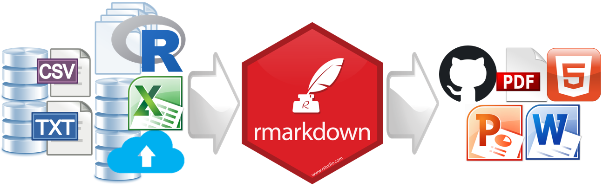

```{r include = FALSE}
library(knitr)
opts_knit$set(root.dir = "../")
opts_chunk$set(echo = FALSE, out.width = "80%")
```

# about the course

*What is reproducible research?* 

Reproducible research comprises a set of software tools and workflow practices that can improve your productivity over the lifetime of a project, especially for data-intensive, computationally-intensive work.  Reproducible research is about explicitly linking the data files and computer code that generate your findings to the technical documents and presentations in which you present your findings.  

```{r out.width = "60%"}

```

*Why you?*

You sense that your effectiveness on computationally-intensive projects could be improved if you knew better how to 
 
- automate typically manual operations such as copying-and-pasting results from one software package to another 
- use version control to keep track of changes and return to earlier versions if necessary 
- organize your work to save time when work has to be revised or repeated 
- manage the seemingly endless growth of the number of files 
- reproduce your own work when revisiting it after a hiatus 


*What are the costs?* 

The costs are your time and effort to 

- learn, adopt, and use the tools and practices 
- collaborate with others not using reproducible methods


*Who benefits?*

Even if no one ever attempts to reproduce your work, you will. Thus the primary beneficiaries are  

- your future self  
- your collaborators  
- your organization  
