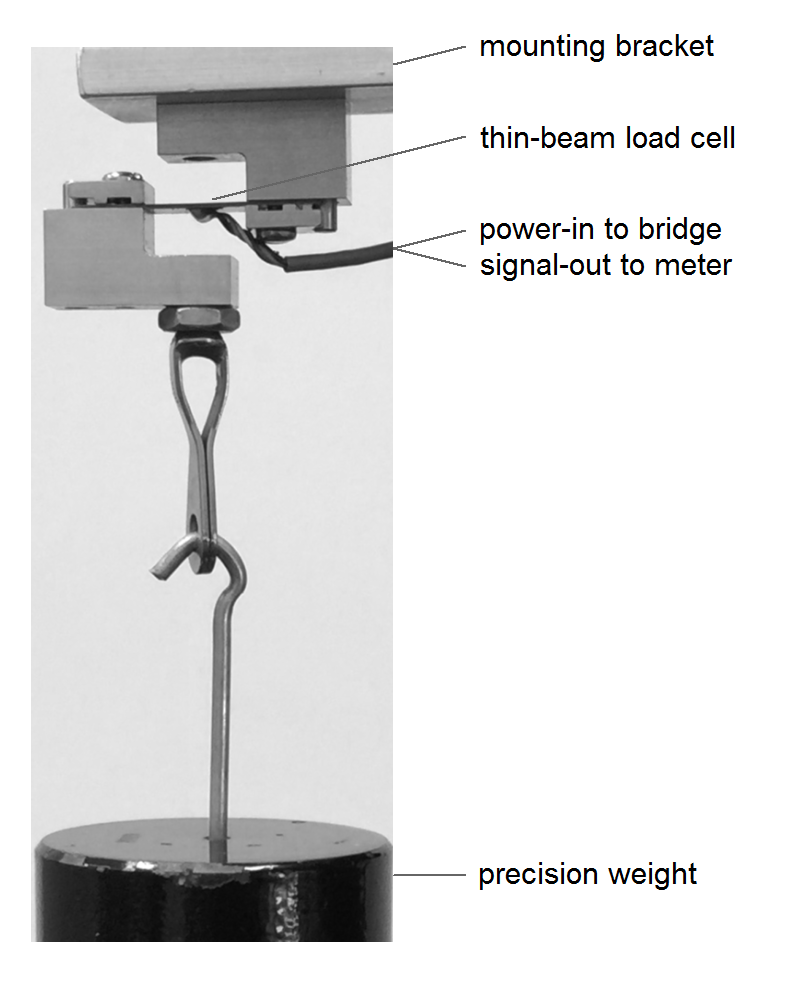
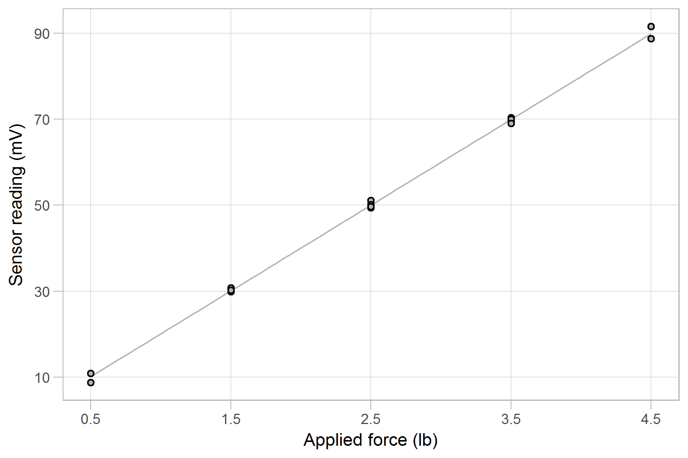

# write the client report

How to use this tutorial

  - <!-- --> *add text*: type the
    prose verbatim into the Rmd file
  - <!-- --> *add code*: insert a
    code chunk, then transcribe the R code
  - <!-- --> *knit* after each
    addition.
  - *Install* packages one time only
  - *Load* a package using `library()` every session

Packages used in this tutorial

  - plyr
  - dplyr
  - readr

## open a new Rmd script

Open a new Rmd file, and name it `06_calibr_report.Rmd`. Save it to the
`reports` directory.

Edit the YAML header:

    ---
    title: "Load-cell calibration report"
    author: "your name"
    date: "date"
    output: word_document
    ---

  - LaTeX users can use `output: pdf_document` if they choose

Delete the rest of the pre-populated text. Insert knitr setup code

<!-- -->

    library(knitr)
    opts_knit$set(root.dir = '../')
    opts_chunk$set(echo = FALSE)

  - `echo = TRUE` is useful for working drafts
  - `echo = FALSE` for the final client report

Knowing the packages we’ll be using, we can load them right away, near
the top of the file.

<!-- -->

``` r
# load packages
library(plyr)
suppressPackageStartupMessages(library(dplyr))
library(readr)
```

## assign sensor make and model

The make and model number of the sensor were provided by the test lab
but do not appear in the data set. Here, we’ll assign those
characteristics to variables so that if they change, we only have to
change them in one place in the report.

<!-- -->

``` r
# sensor characteristics (hard-coded) 
sensor_model <- "Omega LCL-005"
force_limit  <- 5
force_unit   <- "lb"
```

## import regression outcomes

Here we import and manipulate regression outcomes we computed earlier
and saved in the `results` directory. I import them before starting the
prose because some of these values are used in the early paragraphs.

This section is another example of code that was developed iteratively
while drafting the report. Initially, I just started the draft prose. As
I worked, I identified variables I would need in my workspace before the
first paragraph, e.g., `sensor_model`, `force_limit`, and `force_unit`.

<!-- -->

``` r
# itemized results that are cited in the report 
results_df <- read_csv('results/04_calibr_outcomes.csv')
```

Learn R

  - `read_csv()` produces a data frame object

Selecting specific numbers from these regression outcomes is easier if
we convert the data frame to a list.

<!-- -->

``` r
# specific numbers are easier to extract from a list
results_list <- dlply(results_df, 'item')
```

Learn R

  - `dlply()` is a function in the `plyr` package that operates on a
    data frame (`results_df`) and produces a list (`results_list`).
  - the `'item'` argument creates `results_list` as a “list of 8” — each
    observation in the data frame `item` column becomes one entry in the
    list.

To see the structure of these objects for yourself, in the Console, type

  - `glimpse(results_df)` to see the data frame
  - `glimpse(results_list)` to see the list of 8

Note that each item in `results_list` (accuracy, input\_max, etc) is a
data frame containing one row from the original data frame with columns:
`item` (a string), `num` (a number), and `unit` (another string).

## extracting specific values

To extract a specific value, we use `$` notation to subset twice, first
to subset the top-level list, second to subset the lower-level data
frame.

<!-- -->

``` r
# extract slope
slope <- results_list$slope$num 
```

  - `$slope` subsets the top-level list
  - `$num` subsets the slope data frame

Repeat for the remaining values we want for the report.

<!-- -->

``` r
# extract the remaining values
intercept   <- results_list$intercept$num  
accuracy    <- results_list$accuracy$num 
resid_bound <- results_list$resid_bound$num  
input_min   <- results_list$input_min$num  
input_max   <- results_list$input_max$num 
output_min  <- results_list$output_min$num 
output_max  <- results_list$output_max$num  

# extract units
input_unit  <- results_list$input_min$unit 
output_unit <- results_list$output_min$unit 
```

When drafting this report, I did not necessarily know which regression
outcomes I would want. The values and units listed above were developed
iteratively as I drafted and revised the client report.

Next, there are a couple of values I have to compute to use in the
report.

<!-- -->

``` r
# compute range and span
output_span <- output_max - output_min
input_range_fraction <- round(input_max / force_limit * 100, 1)
```

Good coding practice

  - Avoid hard-coding numbers when possible.
  - If you must hard-code values like the sensor characteristics I
    assigned at the top of this file, perform a check to be sure that
    hard-coded values are consistent with the data (especially important
    for reproducibility when the data change).

Below, I check two conditions comparing the maximum force in the data
set to the hard-coded sensor range. The maximum force in the data set:

1.  Should not exceed the sensor range
2.  Should be at least 90% of the sensor range (required by the ANSI
    standard)

<!-- -->

``` r
# Max force in data should not exceed the sensor range
stopifnot(input_max <= force_limit)

# Max force in data should be at least 90% of the sensor range
stopifnot(input_range_fraction >= 90)
```

Learn R

  - `stopifnot()` stops the code execution and produces an error message
    if any argument returns `FALSE`
  - `<=` (less than or equal) and `>=`(greater than or equal) are
    logical operators that return logical values `TRUE` or `FALSE`
  - Go [here](http://www.statmethods.net/management/operators.html) for
    a quick introduction to logical operators

To test these error-detecting tests, change the argument to read

  - `stopifnot(10 * input_max <= force_limit)`

Alternatively,

  - `stopifnot(0.1 * input_range_fraction >= 90)`

In either case, you should see an error statement in the `R Markdown`
pane. Make sure you undo the changes.

## start the prose and use inline code

In my very first draft of the report file, the heading and introduction
below were right at the top of the file. The code we just completed came
later, as I worked out what variables I wanted to assign to support
reproducibility.

<!-- -->

<pre class="r"><code># Introduction

The goal of this analysis is to determine the calibration equation and sensor accuracy for an <code>`</code>r sensor_model<code>`</code> (0--<code>`</code>r force_limit<code>`</code> <code>`</code>r force_unit<code>`</code>) load cell. 
</code></pre>

Learn Rmd

  - Code results can be inserted directly into the text of a .Rmd file
    by enclosing the code with \` r    \`.

Here, for example, I’ve used three inline code chunks to report values
in the first paragraph.

  - \` r  sensor\_model\` is replaced in the output document by its
    value, “Omega LCL-005”
  - \` r  force\_limit\` is replaced in the output document by its
    value, “5”
  - \` r  force\_unit\` is replaced in the output document by its value,
    “lb”

Inline code is one of our tools for reproducibility. If the data or
analysis change, inline expressions reported in the prose are
automatically updated.

## import an image

Here we import and discuss the test setup image given to us by the lab
that we saved in the `resources`
directory.

<!-- -->

<pre class="r"><code>The test setup is illustrated in Figure 1. Precision weights (0.1% accuracy) are used to apply the reference force (<code>`</code>r input_unit<code>`</code>) to the load cell and the resulting voltage readings (<code>`</code>r output_unit<code>`</code>) from the sensor are recorded. The test procedure follows the ANSI/ISA standard.
</code></pre>

Inline code is used again to write the units of input and output.

  - \` r  input\_unit\` is replaced in the output document by its value,
    “lb”
  - \` r  output\_unit\` is replaced in the output document by its
    value, “mV”

<!-- -->

``` r

```

  - To add a figure caption, we add an argument to the code chunk
    header, e.g. `{r fig.cap = "Figure 1. Load cell calibration test
    setup"}`.

## create a data table

Here we import and discuss the table we created earlier and saved in the
`results` directory.

<!-- -->

<pre class="r"><code># Data

The calibration data are shown in Table 1. The maximum force (<code>`</code>r input_max<code>`</code> <code>`</code>r input_unit<code>`</code>) is <code>`</code>r input_range_fraction<code>`</code>% of the <code>`</code>r force_limit<code>`</code> <code>`</code>r force_unit<code>`</code>  sensor limit, per the ANSI/ISA standard. The NA entries in the first and last columns are artifacts of the ANSI/ISA test procedure (the test starts and stops at a mid-range test point in the same direction).
</code></pre>

Again, we’ve used several inline code chunks for reproducibility.

<!-- -->

``` r
# tabulated data we saved earlier
tabulated_data <- read_csv('results/01_calibr_data-wide.csv')
kable(tabulated_data, caption = "Table 1. Calibration data")
```

Learn knitr

  - `kable()` prints a data frame as a table to the output document. The
    format is simple, but fast and easy to create
  - If the `kable()` output format does not meet your needs, the
    `pander` package offers additional control for tables and other
    elements. See the paragraph [Tables using
    pander](http://rmarkdown.rstudio.com/articles_docx.html) for an
    introduction.

## inline math symbols

<!-- -->

<pre class="r"><code># Results

The calibration data and calibration curve are shown in Figure 2. The maximum $\pm$ deviations of the data from the best-fit curve (residuals) are the values used to estimate sensor accuracy. 
</code></pre>

Math in Rmd

  - Inline math expressions use LaTeX syntax enclosed in $ $.
  - `\pm` is the LaTeX markup for the plus-minus symbol
  - See
    [here](https://www.sharelatex.com/learn/List_of_Greek_letters_and_math_symbols)
    for basic LaTeX symbols

## import the graph

Here we import and discuss the graph we created earlier and saved in the
`results` directory.

<!-- -->

``` r

```

## display equation

The calibration equation is the first of the two main results.

<!-- -->

<pre class="r"><code>The calibration equation is
$$
y = <code>`</code>r sprintf("%.3f", slope)<code>`</code>  x + <code>`</code>r sprintf("%.3f", intercept)<code>`</code>
$$
with *x* in <code>`</code>r input_unit<code>`</code> and *y* in <code>`</code>r output_unit<code>`</code>.
</code></pre>

Math in Rmd

  - Display equations use LaTeX expressions enclosed in `$$ $$`.
  - Display equations start a new line in the document and are centered
    in the page width.

Inline code with `sprintf` formatting

  - The inline code chunks replace `slope` and `intercept` with their
    values and units.
  - `sprintf()` formats the values using conventional C-style
    formatting, e.g., `"%.3f"` formats a double precision value with 3
    decimal places.

## conclude the findings

The accuracy of the sensor is the second of the two main
results.

<!-- -->

<pre class="r"><code>The largest residual is <code>`</code>r sprintf("%.1f", resid_bound)<code>`</code> <code>`</code>r output_unit<code>`</code> and the output span is <code>`</code>r sprintf("%.1f", output_span)<code>`</code> <code>`</code>r output_unit<code>`</code>, yielding a sensor accuracy as a percent of reading of 
$$
\pm <code>`</code>r sprintf("%.1f", accuracy)<code>`</code>\%. 
$$
The accuracy of the precision weights, 0.1%, is less than one tenth the load cell accuracy, thereby meeting the requirements of the ANSI/ISA standard. 
</code></pre>

Math in Rmd

  - To get the percent symbol in the math expression, it has to be
    “escaped” using a backslash, i.e., `\%`

Again, we use inline code chunks as often as possible to avoid
hard-coding results and support reproducibility.

## make revisions only in the script

Never make changes to the `docx` output file created from your Rmd
script. If you run the script again, those changes will be lost.

## check yourself

Your directories should contain these files:

    data\
      |-- 007_wide-data.csv
      |-- 01_calibr_data_active-report.csv
      `-- 02_calibr_data-tidy.csv
      
    reports\
      |-- 06_calibr_report.docx
      `-- 06_calibr_report.Rmd
      
    resources\
      `-- load-cell-setup-786x989px.png
      
    results\
      |-- 01_calibr_data-wide.csv
      |-- 03_calibr_graph-draft.png
      |-- 04_calibr_outcomes.csv
      `-- 05_calibr_graph.png
      
    scripts\
      |-- 01_calibr_data-wide.Rmd
      |-- 02_calibr_data-tidy.Rmd
      |-- 03_calibr_graph-draft.Rmd
      |-- 04_calibr_regression.Rmd
      `-- 05_calibr_graph.Rmd

## push to github

  - RStudio Environment pane,`Git` tab
  - Check the `Staged` box for new files and folders
  - `Commit`
  - Type a unique commit message
  - `Commit`
  - `Close`
  - `Push`
  - `Close`

## check yourself

  - Online, navigate to your project repo on GitHub.
  - The new files and folders should be there

[main page](../README.md)
