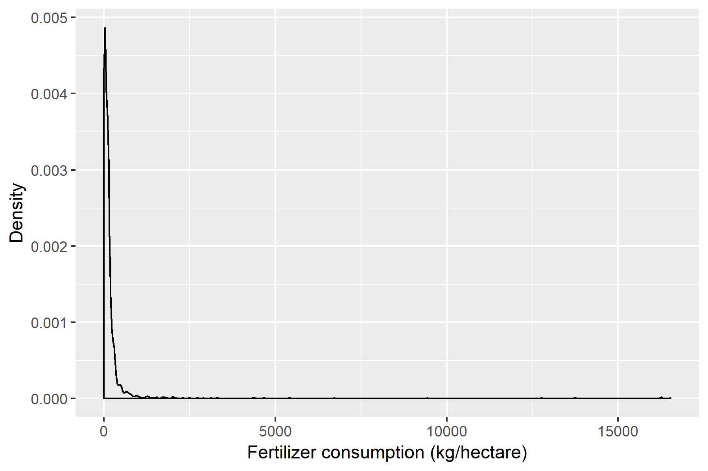
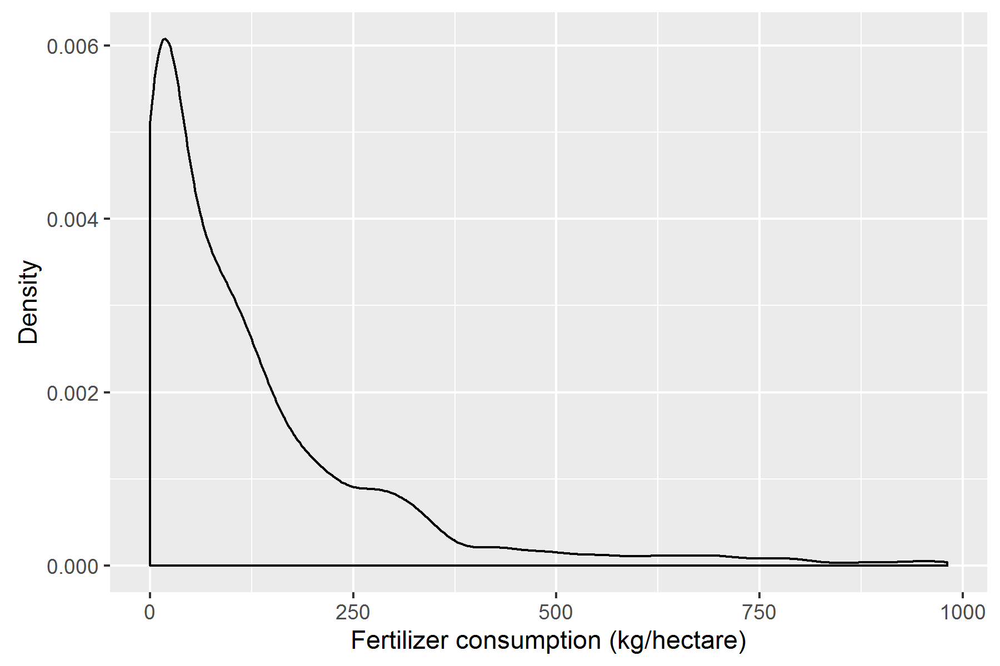

# subsetting

  - Please launch the `practiceR` project.  
  - Open the `chapter7.Rmd` script and continue adding to it from this
    tutorial.

<!-- -->

``` r
# packages 
library(plyr)
library(dplyr)
library(readr) 
library(tidyr)
library(stringr)
library(WDI)
library(ggplot2)
```

## subsetting we did in project 1

We’ve seen quite a bit of subsetting activity already in Project 1.

  - `filter()` to subset a data frame by designated rows

  - `select()` to subset a data frame by designated columns

  - single brackets `[]` and double brackets `[[]]` as follows:

In Project 1, you saw this next bit of code,

``` 
    objects_to_subset <- c("coefficients", "residuals", "fitted.values")
    relevant_results  <- regr_results[objects_to_subset]
```

where we subsetted **regr\_results** (a list of 12 named objects) using
`[]`. We extracted three objects named `"coefficients", "residuals",
"fitted.values"` to create the **relevant\_results** object.

Also in Project 1, you saw these bits of code,

``` 
    # extract the coefficients  
    coeff     <- relevant_results[['coefficients']] 
    
    # extract slope and intercept 
    slope     <- coeff[['input_lb']] 
    intercept <- coeff[['(Intercept)']] 
```

where we subsetted **relevant\_results** using `[[]]` to extract
**coeff** and and further subsetted **coeff** using `[[]]` to obtain the
single values for **slope** and **intercept** of a regression.

Again, in writing the report for Project 1, we had a data frame
**results\_df** that contained the results of the regression analysis
that we wanted to use in the final report.

``` r
# itemized results that are cited in the report 
results_df <- read_csv('results/04_calibr_outcomes.csv') 
```

We converted that data frame to a list using `dlply`:

``` r
# specific numbers are easier to extract from a list
results_list <- dlply(results_df, 'item')
```

**results\_list** is a list of data frames that includes a **slope**
data frame with three entries: `item`, `num`, and `unit` (see the bottom
of the list).

``` r
str(results_list)
```

    ## List of 8
    ##  $ accuracy   :'data.frame': 1 obs. of  3 variables:
    ##   ..$ item: chr "accuracy"
    ##   ..$ num : num 2.12
    ##   ..$ unit: chr "%"
    ##   ..- attr(*, "vars")= chr "item"
    ##  $ input_max  :'data.frame': 1 obs. of  3 variables:
    ##   ..$ item: chr "input_max"
    ##   ..$ num : num 4.5
    ##   ..$ unit: chr "lb"
    ##   ..- attr(*, "vars")= chr "item"
    ##  $ input_min  :'data.frame': 1 obs. of  3 variables:
    ##   ..$ item: chr "input_min"
    ##   ..$ num : num 0.5
    ##   ..$ unit: chr "lb"
    ##   ..- attr(*, "vars")= chr "item"
    ##  $ intercept  :'data.frame': 1 obs. of  3 variables:
    ##   ..$ item: chr "intercept"
    ##   ..$ num : num 0.137
    ##   ..$ unit: chr "mV"
    ##   ..- attr(*, "vars")= chr "item"
    ##  $ output_max :'data.frame': 1 obs. of  3 variables:
    ##   ..$ item: chr "output_max"
    ##   ..$ num : num 91.6
    ##   ..$ unit: chr "mV"
    ##   ..- attr(*, "vars")= chr "item"
    ##  $ output_min :'data.frame': 1 obs. of  3 variables:
    ##   ..$ item: chr "output_min"
    ##   ..$ num : num 8.7
    ##   ..$ unit: chr "mV"
    ##   ..- attr(*, "vars")= chr "item"
    ##  $ resid_bound:'data.frame': 1 obs. of  3 variables:
    ##   ..$ item: chr "resid_bound"
    ##   ..$ num : num 1.69
    ##   ..$ unit: chr "mV"
    ##   ..- attr(*, "vars")= chr "item"
    ##  $ slope      :'data.frame': 1 obs. of  3 variables:
    ##   ..$ item: chr "slope"
    ##   ..$ num : num 20
    ##   ..$ unit: chr "mV/lb"
    ##   ..- attr(*, "vars")= chr "item"
    ##  - attr(*, "class")= chr [1:2] "split" "list"

We can use `$` subsets to extract the numerical value of the slope by:

``` r
# extract the slope data frame from results_list
slope_df <- results_list$slope

# extract the slope number from the slope_df data frame
slope    <- slope_df$num
```

Similarly, we used `$` subsetting to extract other **results\_list**
numbers and units, e.g.,

``` 
    # extract numbers from results_list 
    intercept   <- results_list$intercept$num  
    accuracy    <- results_list$accuracy$num  
    
    # extract units from results_list
    input_unit  <- results_list$input_min$unit 
    output_unit <- results_list$output_min$unit 
```

# subsetting by data values (7.1.5)

We’ll continue with the `WDI` data frame we called **CompleteLongFert**
last time. Here’s a reminder of what that data frame looks like:

<!-- -->

    ## # A tibble: 6 x 5
    ##    Year Abbr  Country     fert_consump log10_consump
    ##   <int> <chr> <chr>              <dbl>         <dbl>
    ## 1  2005 AF    Afghanistan         4.24         0.627
    ## 2  2006 AF    Afghanistan         6.29         0.799
    ## 3  2007 AF    Afghanistan         3.62         0.559
    ## 4  2008 AF    Afghanistan         2.99         0.476
    ## 5  2009 AF    Afghanistan         4.52         0.655
    ## 6  2010 AF    Afghanistan         4.25         0.628

If we graph **fert\_consump** using a probability density graph, we
obtain:

<!-- -->

``` r
# create the graph
fig1 <- ggplot(CompleteLongFert, aes(fert_consump)) +
    geom_density() + 
    xlab("Fertilizer consumption (kg/hectare)") +
    ylab("Density")

# save the graph to file 
ggsave("results/ch7_fert-consump-1.png", fig1, width = 6, height = 4, units = "in", dpi = 300)
```

<!-- -->

``` r
# print the graph to screen

```

<!-- -->

The graph shows that the data set has some extreme values, say greater
than 1000 kg/hectare of arable land, that we might look at more closely
to decide whether or not we should keep them in the data set.

To subset the potential outliers, we use a logical test:

<!-- -->

``` r
FertOutliers <- CompleteLongFert %>%
    filter(fert_consump > 1000)
glimpse(FertOutliers)
```

    ## Observations: 39
    ## Variables: 5
    ## $ Year          <int> 2005, 2006, 2008, 2010, 2011, 2007, 2011, 2005, ...
    ## $ Abbr          <chr> "BH", "BH", "BH", "BH", "BH", "JO", "JO", "KW", ...
    ## $ Country       <chr> "Bahrain", "Bahrain", "Bahrain", "Bahrain", "Bah...
    ## $ fert_consump  <dbl> 2907, 9437, 1993, 1721, 1178, 1008, 1228, 4349, ...
    ## $ log10_consump <dbl> 3.46, 3.97, 3.30, 3.24, 3.07, 3.00, 3.09, 3.64, ...

What countries are these? Using a `$` subset and the `unique()`
function:

<!-- -->

``` r
unique(FertOutliers$Country)
```

    ## [1] "Bahrain"              "Jordan"               "Kuwait"              
    ## [4] "Malaysia"             "New Zealand"          "Oman"                
    ## [7] "Qatar"                "Singapore"            "United Arab Emirates"

These countries have relatively small proportions of arable land, thus
their fertilizer consumption per unit area of arable land is
unsurprisingly high.

To subset the data to omit these countries, we use a logical test again,
bu this time we only keep those countries that have a consumption less
than or equal to 1000.

<!-- -->

``` r
SubsetLongFert <- CompleteLongFert %>%
    filter(fert_consump <= 1000)
glimpse(SubsetLongFert)
```

    ## Observations: 1,319
    ## Variables: 5
    ## $ Year          <int> 2005, 2006, 2007, 2008, 2009, 2010, 2011, 2005, ...
    ## $ Abbr          <chr> "AF", "AF", "AF", "AF", "AF", "AF", "AF", "AL", ...
    ## $ Country       <chr> "Afghanistan", "Afghanistan", "Afghanistan", "Af...
    ## $ fert_consump  <dbl> 4.24, 6.29, 3.62, 2.99, 4.52, 4.25, 6.61, 111.60...
    ## $ log10_consump <dbl> 0.627, 0.799, 0.559, 0.476, 0.655, 0.628, 0.820,...

Looking more closely at the rows of this data set, I find there are
entries that are not actually countries. The following list, while not
comprehensive, gives you an idea:

``` r
##  [30] "Caribbean small states"                              
##  [31] "Central Europe and the Baltics" 
##  [46] "Early-demographic dividend"   
##  [47] "East Asia & Pacific"    
##  [54] "Europe & Central Asia"                               
##  [55] "Europe & Central Asia (excluding high income)"       
##  [56] "Europe & Central Asia (IDA & IBRD countries)"   
##  [57] "European Union" 
##  [71] "Heavily indebted poor countries (HIPC)"              
##  [72] "High income"  
```

To create a subset of the data that omits these rows and retains rows
for actual countries only, the first thing I want is a list of country
codes only.

I found an online data set of [country
codes](http://www.iso.org/iso/home/standards/country_codes/country_names_and_code_elements_txt-temp.htm).

To download this data set, I run the following lines just once, then
comment them
out.

<!-- -->

``` r
# url <- "http://www.iso.org/iso/home/standards/country_codes/country_names_and_code_elements_txt-temp.htm"
# destination <- "data/country_codes.txt"
# download.file(url, destination)
```

The data file is not a CSV file. If you open it you’ll see that the data
are separated by semicolons `;` — no problem. That’s what
`readr::read_csv2()` is for.

<!-- -->

``` r
country_codes <- read_csv2("data/country_codes.txt")
head(country_codes)
```

    ## # A tibble: 6 x 2
    ##   `Country Name` `ISO 3166-1-alpha-2 code`
    ##   <chr>          <chr>                    
    ## 1 AFGHANISTAN    AF                       
    ## 2 ÅLAND ISLANDS  AX                       
    ## 3 ALBANIA        AL                       
    ## 4 ALGERIA        DZ                       
    ## 5 AMERICAN SAMOA AS                       
    ## 6 ANDORRA        AD

``` r
# edit the column names
names(country_codes) <- c("country", "code")
head(country_codes)
```

    ## # A tibble: 6 x 2
    ##   country        code 
    ##   <chr>          <chr>
    ## 1 AFGHANISTAN    AF   
    ## 2 ÅLAND ISLANDS  AX   
    ## 3 ALBANIA        AL   
    ## 4 ALGERIA        DZ   
    ## 5 AMERICAN SAMOA AS   
    ## 6 ANDORRA        AD

Now I’ll subset the column of codes:

<!-- -->

``` r
these_are_countries <- country_codes$code
glimpse(these_are_countries)
```

    ##  chr [1:249] "AF" "AX" "AL" "DZ" "AS" "AD" "AO" "AI" "AQ" "AG" "AR" ...

And now I’ll use these codes to subset the fertilizer data, keeping only
those rows whose country codes match the **keep\_these** list.

<!-- -->

``` r
Fert_Countries <- SubsetLongFert %>%
    filter(Abbr %in% these_are_countries)
glimpse(Fert_Countries)
```

    ## Observations: 1,046
    ## Variables: 5
    ## $ Year          <int> 2005, 2006, 2007, 2008, 2009, 2010, 2011, 2005, ...
    ## $ Abbr          <chr> "AF", "AF", "AF", "AF", "AF", "AF", "AF", "AL", ...
    ## $ Country       <chr> "Afghanistan", "Afghanistan", "Afghanistan", "Af...
    ## $ fert_consump  <dbl> 4.24, 6.29, 3.62, 2.99, 4.52, 4.25, 6.61, 111.60...
    ## $ log10_consump <dbl> 0.627, 0.799, 0.559, 0.476, 0.655, 0.628, 0.820,...

  - `%in%` returns a logical vector with TRUE indicating that an element
    of **Abbr** matches an element of **these\_are\_countries**.
  - The new data set with countries only has 1046 rows compared to the
    1358 we started with.

Let’s take a look at the distribution of the fertilizer consumption data
now:

<!-- -->

``` r
# create the graph
fig2 <- ggplot(Fert_Countries, aes(fert_consump)) +
    geom_density() + 
    xlab("Fertilizer consumption (kg/hectare)") +
    ylab("Density")

# save the graph to file
ggsave("results/ch7_fert-consump-2.png", fig2, width = 6, height = 4, units = "in", dpi = 300)
```

<!-- --> `{ 028-20} # import the
figure and print to screen
`

-----

[main page](../README.md)
