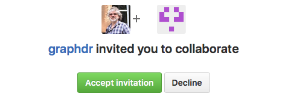
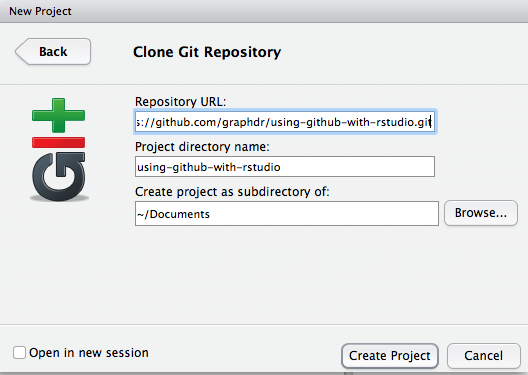

roles and tasks for collaborating via GitHub
============================================

The way we are using version control for collaboration, we get four primary benefits:

-   Reproducing one another's work
-   Reviewing and commenting on one another's changes
-   Resolving conflicts
-   Revert to an earlier version of a file

This page describes your tasks as both author and collaborator

-   For Project 2, with the collaborators already assigned, do the work described here as a rehearsal.
-   For Project 3, you will be assigned a new collaborator, and will do this work again in greater detail.

cast
----

 **Alice** is the Author, the owner of the repository.

 **Carlos** is the Collaborator whom Alice invited to join her repo.

Images
[Alice](https://goo.gl/sNnslf) (2014) by Thierry Baboulenne, [CC BY-NC-ND 2.0](https://creativecommons.org/licenses/by-nc-nd/2.0/).
[Carlos](goo.gl/kTWnIK) (2008) by Anibal de la Torre, [CC BY-NC-ND 2.0](https://creativecommons.org/licenses/by-nc-nd/2.0/). Cropped and gray-scaled by RAL.

git jargon
----------

-   "clone" a project from a remote repo to a local directory
-   "commit" to record changes locally
-   "conflict" when author and collaborator change the same line of the script at the same time
-   "gitignore" lists local files excused from version control, that is, not "seen" by git so never staged, committed, pushed, or pulled --- and therefore not shared with collaborators
-   "history" illustrates commits by everyone
-   "local" is your personal computer
-   "pull" fetch files from GitHub and merge with your local version of the project
-   "push" send committed changes to the remote repo
-   "remote" is the GitHub server
-   "revert" to recover an earlier version of a file
-   "stage" to select files to commit locally

alice starts
------------

**Alice is you**, in your role as author of the repo. Most of you will have completed these first steps already. Alice should have:

-   Created a private, remote repo for her project
-   Created a new, local R project with version control, using the remote repo URL
-   In GitHub, sent Carlos an invitation to collaborate
-   Written local scripts for her project

**Alice (you) has new work to do**. To help her collaborator, Alice should edit the project `README.md` file (located in the top-level project directory) to:

-   Describe the project so Carlos is able to understand the work
-   Describe the order in which to run which scripts
-   Stage, commit, and push to GitHub

**The next time** Alice works on the project,

-   *Pull* first

just in case Carlos made changes since the last time Alice updated the remote repo on GitHub.

**Update** R and all packages to the most recent versions.


carlos' first steps
-------------------

**Carlos is you too**, in your role as collaborator. Carlos:



-   In GitHub, accepts Alice's invitation
-   Navigates to Alice's repo
-   Clicks *Clone or download*


-   Copies the URL
-   Locally, opens a new RStudio project *File &gt; New Project &gt; Version Control &gt; Git*
-   Pastes in the URL of Alice's repo
-   Selects a directory for the new project folder locally
-   *Create Project*. Carlos now has a copy Alice's remote repository saved on his local computer as an RStudio Project.



**The next time** Carlos works on the project,

-   *Pull* first

just in case Alice made changes since the last time Carlos updated the remote repo on GitHub.

**Update** R and all packages to the most recent versions.

alice works
-----------

Alice works on her project at her own pace locally.

If you start a work session and edit your files and then *Pull*, you might get a message like this one. All you have to do is *Stage* and *Commit* the files locally, then you can *Pull*.


Alice also sets aside some time for reviewing and responding to Carlos' questions and comments (if any):

-   *Stage* and *Commit* changes (DO NOT *Push* to GitHub yet)
-   Add to the *gitignore* file when necessary
-   *Pull* first
-   Check Git History to see if Carlos made changes
-   If Carlos made no changes, *Push*

If Carlos did make changes, Alice responds as described after the next section.

carlos works
------------

**First, get acquainted with Alice's project.**

Carlos launches his local version of Alice's project.

-   *Pull* first in case Alice updated the remote repo
-   Read the README
-   Has Alice clearly explained what the project is about?
-   Has Alice explained the order in which to run the scripts?

Review the file management:

-   Do the scripts conform to our recommendations: length, do one task only, read in and write out, commingled prose with code?
-   Does the project use a logical plan for directory structure, and file locations, and file naming?

Comment in the files themselves:

-   Type questions and comments directly into the files (including the README) using the "block quote" markup syntax, making it easy for Alice to find his changes.
-   In Rmd, the markup for a block quote is `>` followed by a space:

<!-- -->

    > Alice, I don't quite understand what you mean by "calibration".   

This block quote would appear in the output document as:

> Alice, I don't quite understand what you mean by "calibration".

**Second, knit Alice's project.**

The simplest form of reproducibility is getting the code to run, that is, every file knits and compiles, producing the same outputs that Alice intended.

Carlos attempts to reproduce Alice's work by

-   Installing packages if required by Alice's scripts (Alice might have used a package that Carlos hasn't yet needed)
-   Running and knitting Alice's scripts in the order described in the README
-   Attempting to fix any problems if the files fail to run or knit
-   Writing prose questions and comments in the Rmd file using block quotes so Alice can find it easily.
-   Adding code or comments inside code chunks if needed to correctly run or knit the scripts.

``` r
# Add code or comments inside code chunks if needed 
# to correctly run or knit the scripts. Explain 
# your edits so Alice can respond. 
```

-   If a file fails to knit and you can't fix the problem, note the error message and line number and add a block quote to the Rmd script describing the difficulty.
-   *Commit* your changes
-   *Pull* one more time just in case Alice had pushed additional changes while you were working
-   Resolve conflicts if any (more on this later)
-   *Pull* again
-   *Push* your changes to the remote repo


**Third, assess the logic of Alice's argument.**

Having successfully executed Alice's scripts is only the first step of reproducing her work. After all, just because the code runs doesn't mean the results are credible.

If reproducible research is to be meaningful, Carlos now has to read Alice's literate scripts for understanding: to assess the logic of the analysis, the quality of the argument, the soundness of the data, the quality and relevance of their graphs, etc.

Start by knitting the first script. Assess the contents following these guidelines. Add questions as they occur to you. repeat for each script in turn.

-   Read the output file step by step. Does each step make sense?
-   Are the numbers believable?
-   Does the prose make sense?
-   Are the data complete? Can you think of data that should be included that aren't?
-   Do you believe the data carpentry? Is it logical? Is it reasonable?
-   Does the script lay out a rational argument for each step in the process? Did the author omit an explanation that was obvious to them but not obvious to you?
-   Again, write your thoughts in the prose sections (using block quotes) and in the code chunks (well-commented) as you see fit.

Use this [comprehensive checklist for reproducibility](http://ropensci.github.io/reproducibility-guide/sections/checklist/) as you review Alice's work. (And your own work too of course.)

The next time you review the work, review Alice's responses and assess whether or not your questions have been adequately addressed.

**Carlos' job overall** is to critique Alice's work and make suggestions for improvement in an iterative process as a collaborator who wishes the work to be credible and successful.

alice responds to carlos' review
--------------------------------

Once Carlos has made comments,

-   Alice resolves conflicts, if any (more on this later)
-   Alice reads and respond to Carlos' suggestions, questions, etc. and edits the scripts in response
-   *Pull* one more time just in case Carlos had pushed additional changes while you were working
-   *Push*

Every Rmd script in the workflow serves as documentation of the thinking that goes into every step of the work. Therefore, when Alice responds to Carlos' comments or questions, it's a good idea to leave the comments or questions in place with the answers (except for the client report). As time goes on, these sections can be edited or summarized, but never deleted---your future self thanks you.

**Alice's job overall** is to explain her rationale for each step of the work and to produce a final report that would survive scrutiny by external experts or auditors.

See the next page for
---------------------

-   changes without conflicts
-   resolving conflicts
-   reverting to a previous version

------------------------------------------------------------------------

[main page](../README.md)
