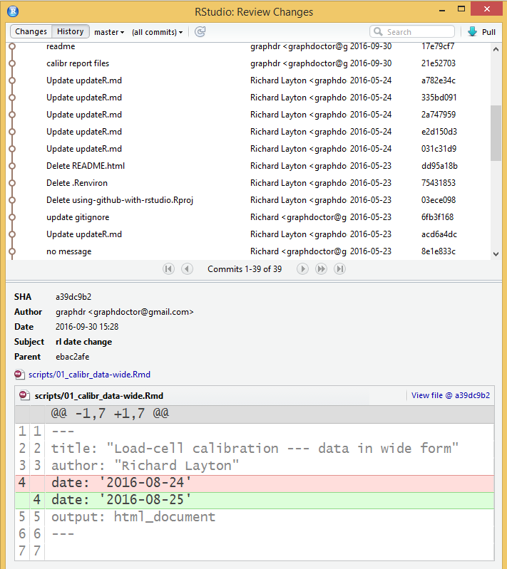
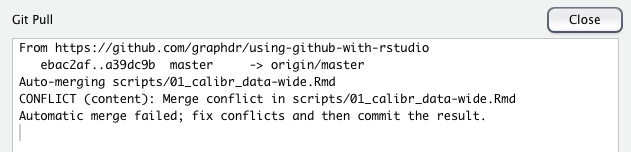
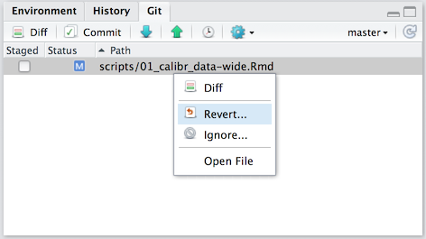
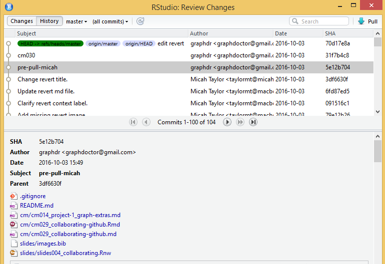
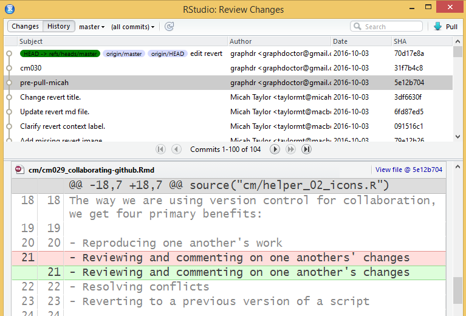
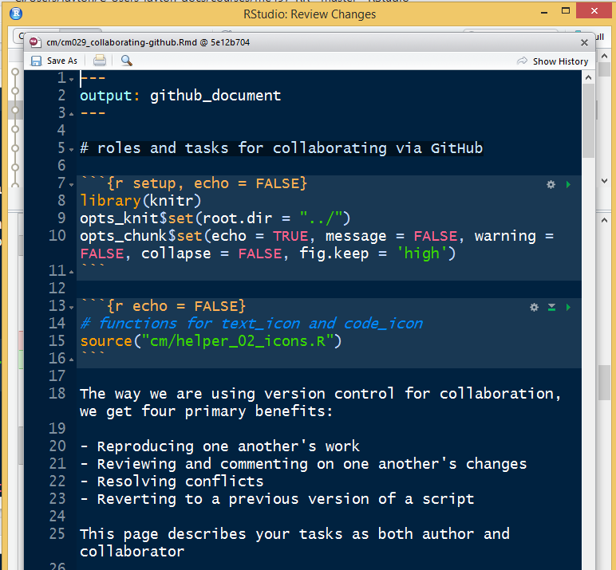

---
output: github_document
--- 

# managing changes and conflicts  

```{r setup, echo = FALSE}
library(knitr)
opts_knit$set(root.dir = "../")
opts_chunk$set(echo = TRUE, message = FALSE, warning = FALSE, collapse = FALSE, fig.keep = 'high')
```

```{r echo = FALSE}
# functions for text_icon and code_icon
source("cm/helper_02_icons.R")
```

See the previous page for your tasks as author and collaborator and for descriptions of git jargon. On this page, we describe:  

- changes without conflicts 
- resolving conflicts 
- reverting to a previous version 


## changes without conflicts 

Via RStudio, the stage-commit-pull-push process will automatically merge everyone's changes in chronological order without fuss unless a conflict occurs. 

In the absence of conflicts, Git History shows a tidy, linear sequence of commits. To see the history, in RStudio *Environment* pane, select *Git > History*, for example: 

```{r echo=FALSE}

```

- Each entry is a commit with date and author shown   
- Select an entry in the History window to see the changes that were made in that commit: green highlights are new; red highlights are old 
- Click *View file \@* to see the full file associated with that commit. 
- The `SHA` column shows the "secure hash algorithm", a unique identifier for each commit, allowing you to see who did what when and if you want to, revert to a previous version 


## resolving a conflict 

Suppose Alice and Carlos are working locally, having pulled from the same version of the remote repo. Assume they both edit the same line of a script. 

- One of them will be first to *stage-commit-pull-push*. No problem. 
- The other will *stage-commit-pull* and receive a CONFLICT message, telling them to "fix conflicts and then commit", for example, "  


```{r echo=FALSE}

```


To illustrate a conflict, my collaborator and I both edited the date in the YAML header of one of the calibration project scripts. 
 
RStudio IDs the conflict with `<<<<<<<< HEAD` and `>>>>>>>> long SHA number`, for example, 


```{r echo=FALSE}
knitr::include_graphics("../resources/images/conflict-02-brackets-shown.png")
```

In the Rmd script, 

- Keep the version of the conflicted lines you want 
- Delete the conflicted version you don't want 
- Delete  `<<<<<<<< HEAD` and `>>>>>>>> long SHA number` 
- *Save*, *stage*, *commit*. The commit message should state what conflict was resolved. 
- *Pull* again (just in case the other person has pushed while you were working) 
- *Push* 

When the conflict is resolved, the history graphically illustrates the conflict as a branch and the resolution as a merging of the branch with the main trunk. In this example, `graphdr` was the author and Micah was the collaborator. Micah resolved the conflict. 

```{r echo=FALSE}
knitr::include_graphics("../resources/images/conflict-03-resolved-history.png")
```

## revert before commit   

If you make changes to files and find that you no longer need the changes, you can *revert* the changes easily if you haven't yet staged and committed them.  

*Revert* resets the file to the last version in the repository, erasing any changes you have made. **Be careful!!** There is no way to undo a revert.

- Find the file you wish to revert in the Git tab
- Right click on the file and choose "Revert..."
- Verify this is the correct file and confirm the warning

```{r echo=FALSE}

```

## revert to an earlier committed version 

My approach here is sort of ad-hoc and hacky, but it does work. 

In RStudio, in the *Environment* pane, select *Git > History*. 


- The `subject` column lists the commit messages. (see below) 
- Find the commit you want to revert to and select that line. For example, below, I've selected the commit called "pre-pull micah" 
- When you've selected a line, the files affected by that commit appear in the lower half of the window. 
- Select the Rmd file you want, for example, I've selected `cm/cm029_collaborating-github.Rmd`. 

```{r echo=FALSE}

```


- When the Rmd file is selected, the file changes appear in a new window as shown below. For example, in this commit, I corrected an apostrophe error (red was old, green is new).  
- Notice off to the right, a link named `View file @ 5e12b714` (the 8-character label is a unique commit identifier). 
- Clink the `View File` link 

```{r echo=FALSE}

```

- The `View File` link shows you the Rmd file associated with the commit you selected earlier. (below) 
- Review this file carefully to be sure it is the version you want. 

```{r echo=FALSE}

```

If this is the file you want , here's the hacky part: copy and paste.

- Copy the contents of the `View File` window 
- Open the original script locally 
- Replace the contents with the `View File` contents you just copied 
- Save, Knit, Stage 
- Commit *using a meaningful commit message* because this commit is unlike our usual incremental changes 
- Pull, Push 

In this approach, Git treats this new change just like any other change, so the History will continue to show all earlier versions, including the one just before this version. 
 
So we actually haven't "reverted"---we copied an historical version and saved it as the current version. 

This approach suits *our* collaborative goals, but in future projects you may find that you need to learn the correct Shell commands and processes for conventional reverting.  

## recovering a portion of a script 

The approach described above for recovering an entire script can be used to recover a portion of a script. 

- Find the earlier file like we did above 
- Find the code chuink or prose section you want 
- Copy and paste it into your current script 


--- 
[main page](../README.md)
