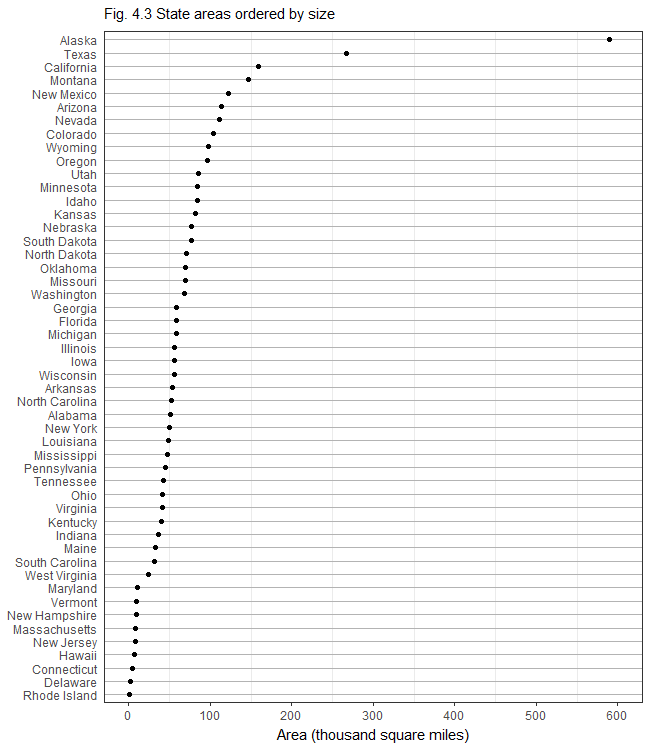
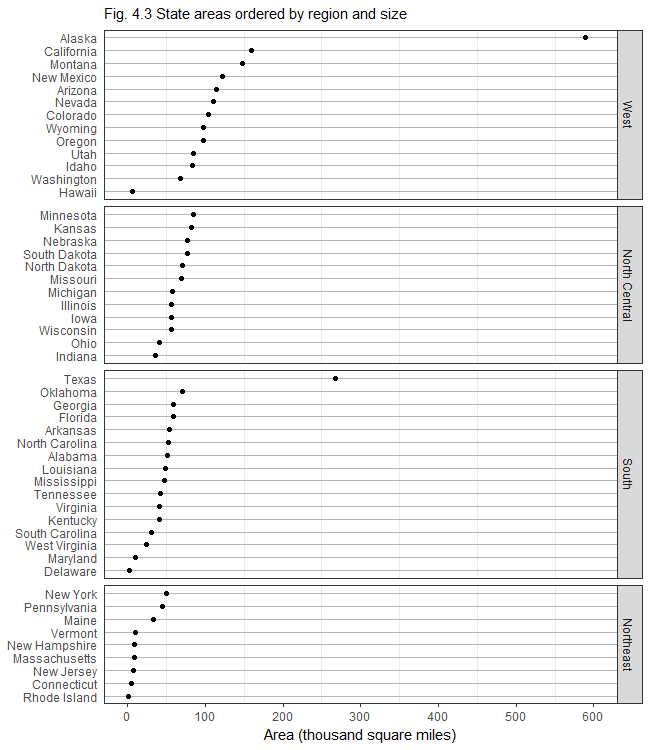

---
output: github_document
--- 

# dot plot  

```{r setup, echo = FALSE}
library(knitr)
opts_knit$set(root.dir = "../")
opts_chunk$set(echo = TRUE, message = FALSE, warning = FALSE, collapse = TRUE, fig.keep = 'high')
```

```{r echo = FALSE}
# functions for text_icon and code_icon
source("cm/helper_02_icons.R")
```

The *dot plot* by Bill Cleveland is a preferred substitute for data typically shown in pie charts or bar charts. If you would like to read more about the rationale behind dot plots, see (Robbins, 2013).  

The data structure for which dot plots are suited are:  

- Observations include one categorical variable and one quantitative variable.  
- The same where the categories are *conditioned* by additional categories. 
- In any case, there is just one numerical quantity displayed, usually along the horizontal $x$ axis. 

## data 

Create `dot_plot.Rmd` in your `practiceR/scripts/` directory. Write the code chunks in the tutorial with as much of the prose as you like  to explain the work. 

`r code_icon` 
```{r}
library(ggplot2)
library(dplyr)
library(readr)
```


We'll use the `state` data we saved earlier (in the factors tutorial). 

`r code_icon` 
```{r}
# read our saved version of the state data sets 
state_df <- read_csv("data/cm034_state.csv")
```

Recall the data structure. 

`r code_icon` 
```{r}
# recall the contents
glimpse(state_df)
```

Examine the area data more closely. 

`r code_icon` 
```{r}
summary(state_df$area)
```

With area values in the hundreds of thousands of square miles, the graph scale is easier to read if we display in thousands of square miles.

`r code_icon` 
```{r}
# create a new column with area in 1000s of sq mi
state_df <- state_df %>%
	mutate(scaled_area = area / 1000)
```

I'm going to assign region as an ordered factor (for graph conditioning), arranged by descending order of the median area in each region. In a column of conditioned ggplot2 graphs, the top panel is determined by the factor level-1, the second panel is level-2, etc. 

```{r}
# region as an ordered factor 
state_df$region <- factor(state_df$region, 
	levels = c("West", "North Central", "South", "Northeast"),
	ordered = TRUE)

# check the result
typeof(state_df$region)

# ordered levels
levels(state_df$region)
```

The West region has a collection of states with the largest median area; the Northeast has the smallest median state area. 

## graph 

The basic dot plot is obtained using the `geom_point()` function. Structurally, this is an x-y scatterplot with the quantitative variable on the x-axis and the qualitative variable on the y-axis. 

`r code_icon` 
```{r}
fig <- ggplot(state_df, aes(x = scaled_area, y = name)) +
  geom_point()

fig
```

To easily make visual comparisons, we'd like the rows of the dot plot ordered in descending values of the areas. The `reorder(name, scaled_area)`  argument can be read, "Reorder the rows (names of the states) from top to bottom in order of descending scaled area (the x variable)."

Edit the previous code. 
```{r}
fig <- ggplot(state_df, aes(x = scaled_area, y = reorder(name, scaled_area))) +
  geom_point()

fig
```

Next, I'll add some formatting layers, most of which you saw in Project 1, to 

- Set the x-scale limits and tick mark locations 
- Set the x label and omit the y label 
- Assign a title 
- Use the black and white theme 
- Omit the x-grid 
- Include the y-grid as gray lines 
- Adjust the title font size and location 
- Omit the y tick marks 

`r code_icon` 
```{r}
fig <- fig +  
  scale_x_continuous(breaks = seq(0, 600, 100), limits = c(0, 600)) +
  labs(x = "Area (thousand square miles)", y = NULL) +
  ggtitle("Fig. 4.3 State areas ordered by size") +
  theme_bw() + 
  theme(panel.grid.major.x = element_blank(),
    panel.grid.major.y = element_line(colour = "grey70"), 
    plot.title   = element_text(size = rel(1), vjust = 1.5),
    axis.ticks.y = element_blank()
    )

fig
```

The graph is a bit compressed vertically, so I'll print to file to control the resolution and dimensions, then read the PNG file back in to the document. I usually do a bit of sizing trial and error before I get an output I like. 

`r code_icon` 
```{r results='hide'}
# print to file
ggsave("results/cm035_dot-plot.png", plot = fig, 
    width = 6.5, height = 7.5, units = "in", dpi = 100)
```

```{r}
# read the PNG file back in to the document

```


## conditioning 

*Conditioning* converts a single dot plot into multiple panels, where each panel is a plot with the same scales, but the data belong to a particular subset of the data. 

The subsets are determined by the levels of the factor used for conditioning. 

In this example, the conditioning variable is `region`, with 4 levels. Thus the conditioned plot has four subpanels, one each for "West", "North Central", "South", and  "Northeast". 

Conditioning in ggplot2 is accomplished using `facet_grid()`. 

`r code_icon` 
```{r}
fig <- fig + 
	facet_grid(region ~ .) 

fig
```

Ouch, that's ugly. 

A typical data set will have an entry for every intersection of the two categorical variables, but here a state name can only belong to one region. 

To eliminate the names that don't exist in a region, we use the `scales = "free_y"` argument.   

Add to the existing code. 
```{r}
fig <- fig + 
	facet_grid(region ~ ., scales = "free_y")

fig
```

The default is for the panels to have the same vertical height. But the number of states in a region is not constant, hence the panels all have different numbers of rows. 

To allow the panel heights to self-adjust for equal row spacing, we add the `space = "free"` argument. 

Add to the existing code and write to file.  
```{r}
fig <- fig + 
	facet_grid(region ~ ., scales = "free_y", space = "free") + 
	  ggtitle("Fig. 4.3 State areas ordered by region and size") 

ggsave("results/cm035_dot-plot-conditioned.png", plot = fig, 
    width = 6.5, height = 7.5, units = "in", dpi = 100)

# read the PNG file back in to the document

```

Pretty neat! 


## references

Figure 4.3 is from Robbins and the `ggplot2` code is adapted from Zhao & Bryan.  

1. Naomi Robbins (2013) [*Creating More Effective Graphs*](http://www.nbr-graphs.com/resources/recommended-books/), Chart House.     
2. Joanna Zhao and Jenny Bryan,  [r-graph-catalog](https://github.com/jennybc/r-graph-catalog), providing ggplot2 scripts for nearly all of the graphs in Robbins' book.    
3. Winston Chang, [Facets (ggplot2)](http://www.cookbook-r.com/Graphs/Facets_(ggplot2)), [Cookbook for R](http://www.cookbook-r.com/).  


--- 
[main page](../README.md)
