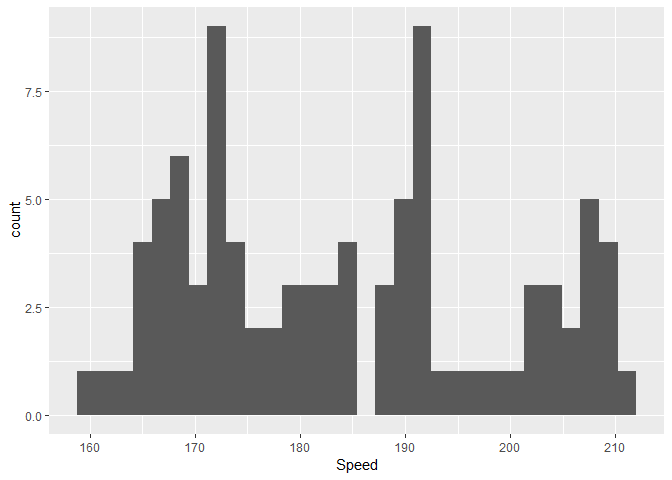
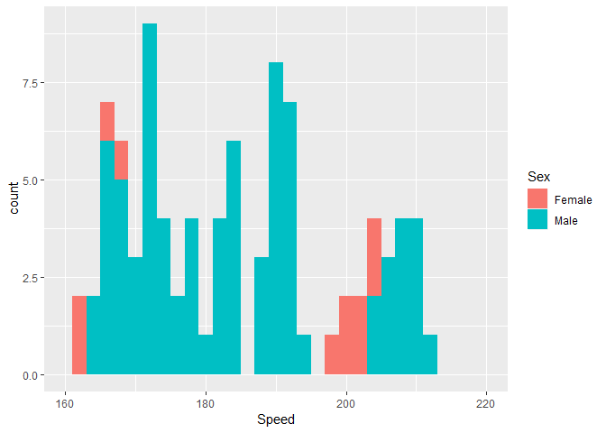
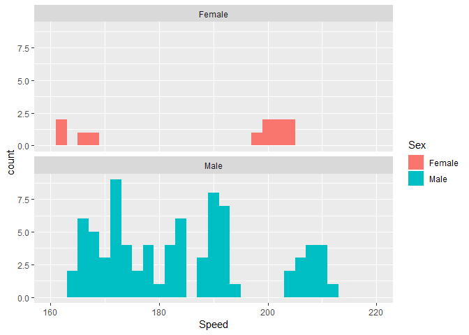
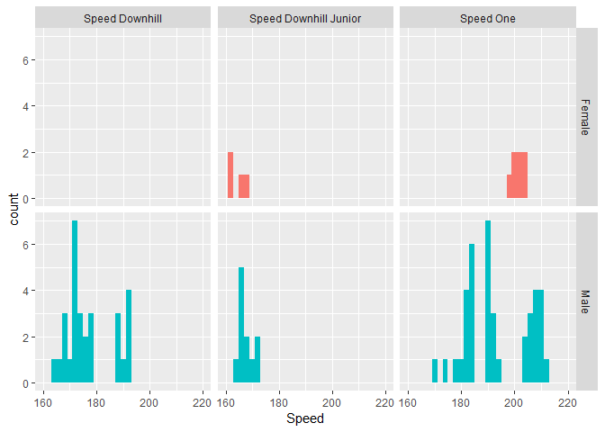
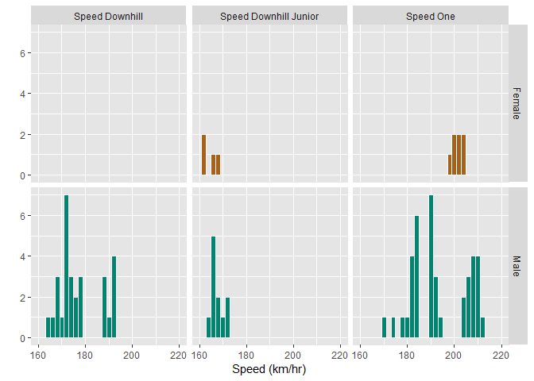

# histogram

## getting started

We’re going to use data from the 2011 World Speed Skiing Championships.
The data set is called `SpeedSki` from the `GDAdata` package. GDA stands
for “Graphical Data Analysis”; the package accompanies the book by Unwin
(2015).

  - First, install the `GDAdata` package (In RStudio, *Packages \>
    Install \> GDAdata*)
  - You can then find out all about the GDAdata package by using the
    RStudio Package window, scroll down until you find `GDAdata`, and
    click on its name. A help window should appear.  
  - Create `histogram.Rmd` in your `practiceR/scripts/` directory. Write
    the code chunks in the tutorial with as much of the prose as you
    like to explain the work.

## data

Load the package and examine the `SpeedSki` data frame. The data frame
is already tidy.

<!-- -->

``` r
# load the package that has the data we want 
library(GDAdata)

# load the data set 
data(SpeedSki)

# examine the data
library(dplyr)
glimpse(SpeedSki)
## Observations: 91
## Variables: 10
## $ Rank       <int> 1, 2, 3, 4, 5, 6, 7, 8, 9, 10, 11, 12, 13, 14, 15, ...
## $ Bib        <int> 61, 59, 66, 57, 69, 75, 67, 58, 62, 56, 81, 80, 93,...
## $ FIS.Code   <int> 7039, 7078, 190130, 7178, 510089, 7204, 7053, 7170,...
## $ Name       <fct> ORIGONE Simone, ORIGONE Ivan, MONTES Bastien, SCHRO...
## $ Year       <int> 1979, 1987, 1985, 1979, 1970, 1993, 1975, 1991, 198...
## $ Nation     <fct> ITA, ITA, FRA, AUT, SUI, FRA, SWE, FRA, CZE, SWE, P...
## $ Speed      <dbl> 212, 210, 210, 210, 209, 208, 208, 208, 207, 207, 2...
## $ Sex        <fct> Male, Male, Male, Male, Male, Male, Male, Male, Mal...
## $ Event      <fct> Speed One, Speed One, Speed One, Speed One, Speed O...
## $ no.of.runs <int> 4, 4, 4, 4, 4, 4, 4, 4, 4, 4, 4, 4, 4, 4, 4, 4, 4, ...
```

Variable **Speed** is a number (km/hr) while variables **Event** and
**Sex** are factors (useful for conditioning).

First graph is a histogram of the counts of all speeds.

<!-- -->

``` r
library(ggplot2)
p <- ggplot(SpeedSki, aes(x = Speed)) + 
    geom_histogram()

p # to print the graph
```

<!-- -->

We can play around with the bin-width to adjust the resolution of the
histogram. A bin width of 2 km/hr gives a useful distribution. You can
try others. In this chunk, I also set my own x-scale limits.

<!-- --> Edit the earlier code
chunk

``` r
# histogram bin width
set_bin <- 2

# plot 
p <- ggplot(SpeedSki, aes(x = Speed)) + 
    geom_histogram(binwidth = set_bin) + 
    xlim(160, 220)

p # to print the graph
```

<!-- -->

Let’s condition the data by Sex. The conditioning is assigned using the
`fill = Sex` argument of the `aes()` specification. Conditioning
automatically assigns a color palette and inserts a legend.

<!-- --> Edit the earlier code
chunk

``` r
p <- ggplot(SpeedSki, aes(x = Speed, fill = Sex)) + 
    geom_histogram(binwidth = set_bin) + 
    xlim(160, 220)

p # to print the graph
```

<!-- -->

Facets (multiple panels) are created using `facet_wrap()` when
conditioning by one variable. By disaggregating the data by Sex, we
eliminate any overlap in the two groups of data. The `ncol= 1` argument
aligns the panels in 1 column.

<!-- -->

``` r
# the facet can be added as a layer 
p <- p + facet_wrap(~ Sex, ncol = 1)

p # to print the graph
```

<!-- -->

The panels are labeled so we can dispense with the legend.

<!-- -->

``` r
# omit the legend
p <- p + theme(legend.position = "none")

p # to print the graph
```

<!-- -->

As Unwin notes in his discussion of these data,

> As well as emphasizing that there were many more competitors in the
> men’s competition than in the women’s, the plots show that the fastest
> person was a man and that a woman was the slowest. What is surprising
> (and more interesting) is that the fastest woman was almost as fast as
> the fastest men and that there were two distinct groups of women, the
> fast ones and the slow ones.

Conditioning the data further by Sex and Event helps explain these
results. Here, we replace the `facet_wrap()` we used earlier with
`facet_grid()` because we are conditioning by two variables, (Sex
category has 2 levels, Event category has 3 levels) creating a
\(2\times 3\) grid of panels.

<!-- -->

``` r
p <- p + facet_grid(Sex ~ Event)

p
```

<!-- -->

A much clearer picture emerges.

  - Speed One is the fastest event (requiring special equipment).
  - In the Speed One competition, women were faster than the majority of
    men.  
  - No women took part in the Downhill.  
  - There is not much variation among the Juniors.
  - The reason for the two female groups is now clear: They took part in
    two quite different events.

Some final tweaks to make the graph more presentable.

<!-- -->

``` r
# outline the bins
p <- p +
    geom_histogram(binwidth = set_bin, color = "white")

# edit the x and y scale labels 
p <- p +
      xlab("Speed (km/hr)") + 
    ylab("")

# edit panel background color to a slightly darker shade of gray 
p <- p +
    theme(panel.background = element_rect(fill = "gray90", colour = "gray90", size = 0.5, linetype = "solid"))

# create some custom colors 
library(RColorBrewer)
BrBG  <- brewer.pal(5, "BrBG")
medBr <- BrBG[1]
medBG <- BrBG[5]

# re-color the bins
p <- p +
    scale_fill_manual(values = c(medBr, medBG)) 

p
```

<!-- -->

## one-chunk

Of course, the steps I’ve shown could have been done in a single code
chunk, e.g.,

``` r
ggplot(SpeedSki, aes(x = Speed, fill = Sex)) + 
  geom_histogram(binwidth = set_bin, color = "white") + 
  scale_fill_manual(values = c(medBr, medBG)) + 
  facet_grid(Sex ~ Event) + 
  xlim(160, 220) + 
  xlab("Speed (km/hr)") + 
  ylab("") + 
  theme(legend.position = "none", panel.background = element_rect(fill = "gray90", colour = "gray90", size = 0.5, linetype = "solid")) 
```

## references

1.  Antony Unwin (2015) *Graphical Data Analysis with R*, CRC Press.

-----

[main page](../README.md)
