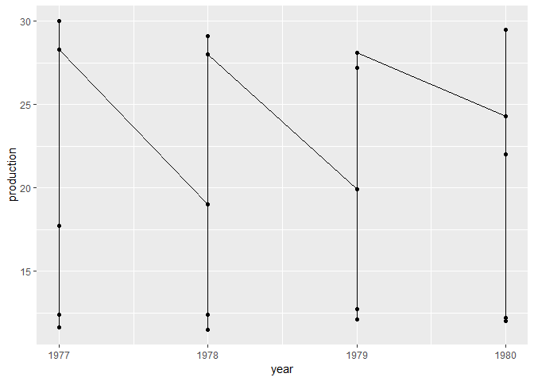
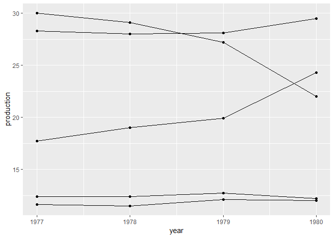
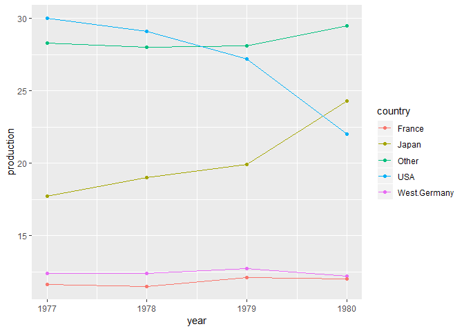
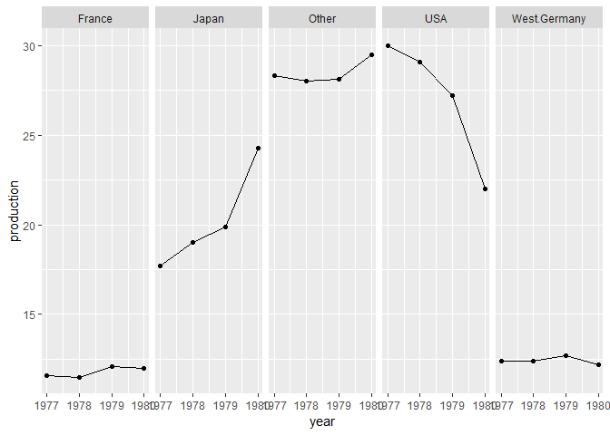
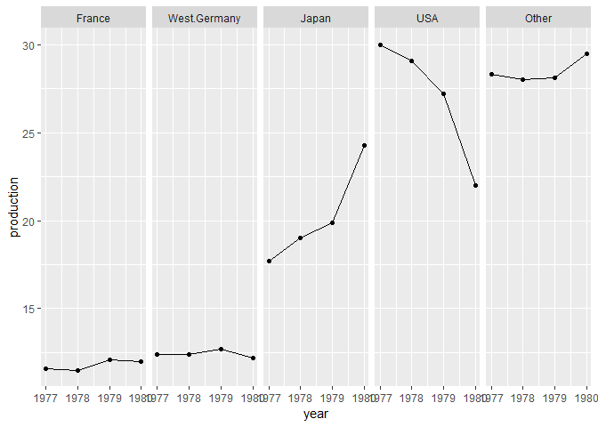
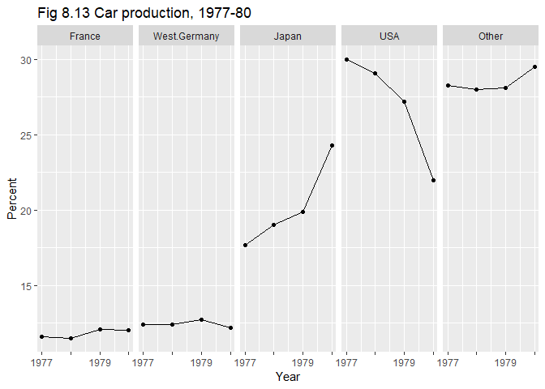

# line graph

## getting started

We’re going to use the car production data from Figure 8.13 in Robbins.
I’ve saved it as a CSV file you can download from the course repo.

  - In the `data/` directory of the course repo, find the data file
    `fig-08-13_data-car-production.csv`
  - Download and save it to your `practiceR/data/` directory
  - Create `line-graph.Rmd` in your `practiceR/scripts/` directory.
    Write the code chunks in the tutorial with as much of the prose as
    you like to explain the work.

## data

The data frame is already tidy.

``` r
library(readr)
library(dplyr)
library(forcats)
df <- read_csv('data/fig-08-13_data-car-production.csv')
glimpse(df)
## Observations: 20
## Variables: 3
## $ year       <dbl> 1977, 1978, 1979, 1980, 1977, 1978, 1979, 1980, 197...
## $ country    <chr> "Japan", "Japan", "Japan", "Japan", "USA", "USA", "...
## $ production <dbl> 17.7, 19.0, 19.9, 24.3, 30.0, 29.1, 27.2, 22.0, 12....
```

For conditioning, we’d like the country variables to be a factor instead
of a character.

``` r
df <- df %>%
    mutate(country = factor(country))
glimpse(df)
## Observations: 20
## Variables: 3
## $ year       <dbl> 1977, 1978, 1979, 1980, 1977, 1978, 1979, 1980, 197...
## $ country    <fct> Japan, Japan, Japan, Japan, USA, USA, USA, USA, Wes...
## $ production <dbl> 17.7, 19.0, 19.9, 24.3, 30.0, 29.1, 27.2, 22.0, 12....
```

## graph

Ignoring country for the moment, let’s graph production by year. We’ll
use a `geom_line()` and a `geom_point` to shows the individual data
markers and to connect the dots.

``` r
library(ggplot2)
ggplot(df, aes(x = year, y = production)) +
  geom_line() +
  geom_point()
```

<!-- -->

Well, that’s a mess.

Do it again, but add the `group` argument to the `aes()` function so the
data are grouped by country. This grouping is why we converted country
from characters to a factor.

``` r
ggplot(df, aes(x = year, y = production, group = country)) +
  geom_line() +
  geom_point()
```

<!-- -->

That’s better, but we don’t know which country is which. For that, we
add the `color` argument to the `aes()` function where we want to group
and color both by
country.

``` r
ggplot(df, aes(x = year, y = production, group = country, color = country)) +
  geom_line() +
  geom_point()
```

<!-- -->

Notice that adding the `color` argument automatically added the legend.

Sometimes, multiple lines on a graph are so close in value, it is
difficult to see the individual trends. In such a case, we want to use a
trellis (or small multiple) design, invoked by the `facet_grid()`
function.

Because we are switching to facets, we delete the group and color by
country we used before and add the `facet_grid()` function.

``` r
ggplot(df, aes(x = year, y = production)) +
  geom_line() +
  geom_point() +
  facet_grid(.~ country)
```

<!-- -->

## panel order

For quantitative data, the panels should be ordered, usually in order of
increasing values, e.g., the production data.

First, let’s look at the existing order of the levels of the country
column (a factor).

``` r
# confirm that the country variable is a factor
class(df$country)
## [1] "factor"

# check the order of the factor levels 
levels(df$country)
## [1] "France"       "Japan"        "Other"        "USA"         
## [5] "West.Germany"
```

Alphabetical, as expected. The graph panels from left to right are also
in this order.

To change the order of the graph panels, we have to change the order of
the factor levels. In a previous example using factors, we simply typed
the levels in the order we wanted them using the `levels` argument of
the `factor()` function.

However, in this example we want to automate the reordering of the
factor levels based on the data in the production column.

The `forcats` package has a function called `fct_reorder()` for
reordering the levels of a factor according to the order of another
variable.

``` r
# reorder the levels of country by the median of the production numbers 
df$country <- fct_reorder(df$country, df$production, fun = median, .desc = FALSE)
```

  - the first argument `df$country` is the factor we want to reorder
  - `df$production` is the variable used to create the ordering
  - `fun = median` is the function to use in ordering the data
  - `.desc` orders in ascending or descending order

<!-- end list -->

``` r
# reorder the country levels by increasing magnitude of production 
# new_levels <- unique(df$country[production_order])

# show the new ordering of levels 
levels(df$country)
## [1] "France"       "West.Germany" "Japan"        "USA"         
## [5] "Other"
```

You can see that the levels are no longer in alphabetical order. Instead
they are in order of increasing production.

Important to note that the reordering of the levels has no effect on the
ordering of the rows of the data frame. All we’ve done is reorder the
integers that encode the factor variable.

Create the graph again using the same code as before. The result shows
that from left top right, the panels are in increasing order of
production.

``` r
p <- ggplot(df, aes(x = year, y = production)) +
  geom_line() +
  geom_point() +
  facet_grid(.~ country) 
p
```

<!-- -->

## edit for publication

There is a bit of overprinting in the time scale, so we can edit the
year labels to show only every other year.

``` r
p <- p + scale_x_continuous(labels = c(1977, "", 1979, ""))
p
```

<!-- -->

Next, axis labels and a title.

``` r
p <- p + labs(x = "Year", y = "Percent") +
  ggtitle("Fig 8.13 Car production, 1977-80")
p
```

<!-- -->

Of course, you could continue to edit for an appearance that you find
suitable for your audience.

## references

Figure 8.13 is from Robbins. The `ggplot2` code is adapted from Zhao &
Bryan.

1.  Naomi Robbins (2013) [*Creating More Effective
    Graphs*](http://www.nbr-graphs.com/resources/recommended-books/),
    Chart House.  
2.  Joanna Zhao and Jenny Bryan,
    [r-graph-catalog](https://github.com/jennybc/r-graph-catalog),
    providing ggplot2 scripts for nearly all of the graphs in Robbins’
    book.  
3.  Winston Chang, [Facets
    (ggplot2)](http://www.cookbook-r.com/Graphs/Facets_\(ggplot2\)),
    [Cookbook for R](http://www.cookbook-r.com/).

-----

[main page](../README.md)
