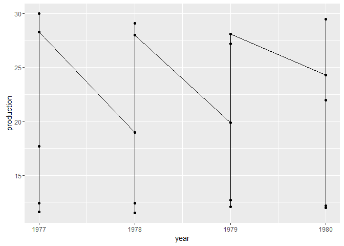
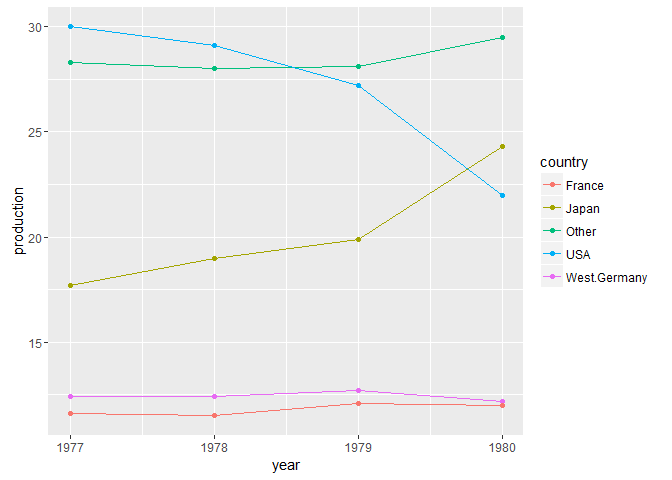
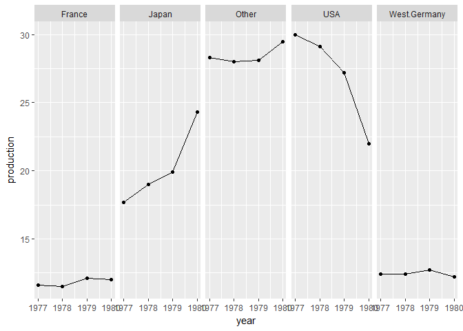
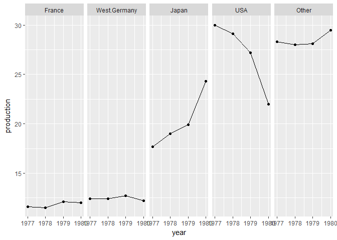
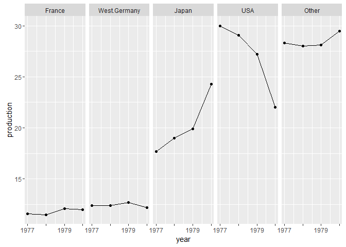
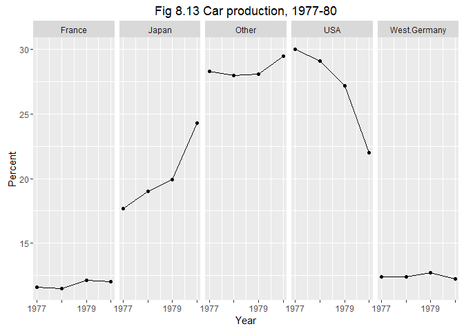

line graph
==========

getting started
---------------

We're going to use the car production data from Figure 8.13 in Robbins. I've saved it in a csv file you can download from the course repo.

-   Download the data file `fig-08-13_data-car-production.csv` and save it in your `practiceR/data/` directory
-   Create `line-graph.Rmd` in your `practiceR/scripts/` directory. Write the code chunks in the tutorial with as much of the prose as you like to explain the work.

data
----

The data frame is already tidy.

``` r
library(readr)
library(dplyr)
df <- read_csv('data/fig-08-13_data-car-production.csv')
glimpse(df)
## Observations: 20
## Variables: 3
## $ year       <dbl> 1977, 1978, 1979, 1980, 1977, 1978, 1979, 1980, 197...
## $ country    <chr> "Japan", "Japan", "Japan", "Japan", "USA", "USA", "...
## $ production <dbl> 17.7, 19.0, 19.9, 24.3, 30.0, 29.1, 27.2, 22.0, 12....
```

For conditioning, we'd like the country variables to be a factor instead of a character.

``` r
df <- df %>%
    mutate(country = factor(country))
glimpse(df)
## Observations: 20
## Variables: 3
## $ year       <dbl> 1977, 1978, 1979, 1980, 1977, 1978, 1979, 1980, 197...
## $ country    <fctr> Japan, Japan, Japan, Japan, USA, USA, USA, USA, We...
## $ production <dbl> 17.7, 19.0, 19.9, 24.3, 30.0, 29.1, 27.2, 22.0, 12....
```

graph
-----

Ignoring country for the moment, let's graph production by year. We'll use a `geom_line()` and a `geom_point` to shows the individual data markers and to connect the dots.

``` r
library(ggplot2)
ggplot(df, aes(x = year, y = production)) +
  geom_line() +
  geom_point()
```



Well, that's a mess.

Do it again, but add the `group` argument to the `aes()` function so the data are grouped by country. This grouping is why we converted country from characters to a factor.

``` r
ggplot(df, aes(x = year, y = production, group = country)) +
  geom_line() +
  geom_point()
```


That's better, but we don't know which country is which. For that, we add the `color` argument to the `aes()` function where we want to group and color both by country.

``` r
ggplot(df, aes(x = year, y = production, group = country, color = country)) +
  geom_line() +
  geom_point()
```



Notice that adding the `color` argument automatically added the legend.

Sometimes, multiple lines on a graph are so close in value, it is difficult to see the individual trends. In such a case, we want to use a trellis (or small multiple) design, invoked by the `facet_grid()` function.

Because we are switching to facets, we delete the group and color by country we used before and add the `facet_grid()` function.

``` r
ggplot(df, aes(x = year, y = production)) +
  geom_line() +
  geom_point() +
  facet_grid(.~ country)
```



panel order
-----------

For quantitative data, the panels should be ordered, usually in order of increasing values, e.g., the production data. First, let's check the order of countries (the order of the levels of the factor).

``` r
# confirm that the country variable is a factor
class(df$country)
## [1] "factor"

# check the order of the factor levels 
levels(df$country)
## [1] "France"       "Japan"        "Other"        "USA"         
## [5] "West.Germany"
```

Alphabetical, as expected. The graph panels from left to right are also in this order. To change panel order, we change the factor level order.

``` r
 # re-order the country panels by increasing magnitude of production 
new_levels <- levels(factor(df$country[order(df$production)]))
df$country <- factor(df$country, levels = new_levels)
```

In this chunk, we:

-   start with production (a numerical vector) and country (a factor vector with 5 levels)
-   recall that the levels of a factor are encoded as integers
-   find the order of the production values and use that to order the factor integers
-   enforce country as a factor, extract the levels (in their new order), and temporarily assign to `new_levels`
-   apply `factor()` to country and assign its `levels` using `new_levels`
-   new country overwrites original country

In this overwriting, remember that the rows of the data frame never changed. Only the integers that encode the levels of `country` changed

Have a look at the new order of the panel levels---yes, they are in a new order.

``` r
# check the new order of the factor levels 
unique(levels(df$country))
## [1] "France"       "Japan"        "Other"        "USA"         
## [5] "West.Germany"
```

Create the graph again using the same code as before. The result shows that from left top right, the panels are in increasing order of production.

``` r
p <- ggplot(df, aes(x = year, y = production)) +
  geom_line() +
  geom_point() +
  facet_grid(.~ country)  
p
```



edit for publication
--------------------

There is a bit of overprinting in the time scale, so we can edit the year labels to show only every other year.

``` r
p <- p + scale_x_continuous(labels = c(1977, "", 1979, ""))
p
```



Next, axis labels and a title.

``` r
p <- p + labs(x = "Year", y = "Percent") +
  ggtitle("Fig 8.13 Car production, 1977-80")
p
```



Of course, you could continue to edit for an appearance that you find suitable for your audience.

references
----------

Figure 8.13 is from Robbins. The `ggplot2` code is adapted from Zhao & Bryan.

1.  Naomi Robbins (2013) [*Creating More Effective Graphs*](http://www.nbr-graphs.com/resources/recommended-books/), Chart House.
2.  Joanna Zhao and Jenny Bryan, [r-graph-catalog](https://github.com/jennybc/r-graph-catalog), providing ggplot2 scripts for nearly all of the graphs in Robbins' book.
3.  Winston Chang, [Facets (ggplot2)](http://www.cookbook-r.com/Graphs/Facets_(ggplot2)), [Cookbook for R](http://www.cookbook-r.com/).

------------------------------------------------------------------------

[main page](../README.md)
