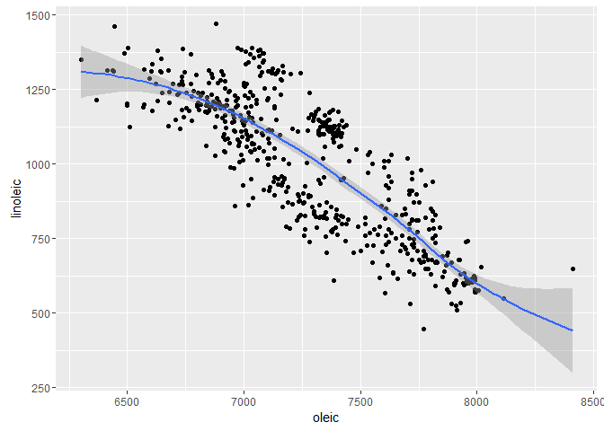
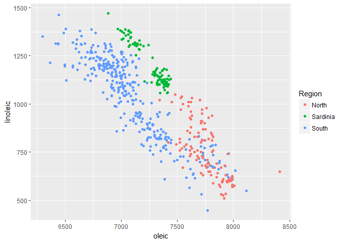
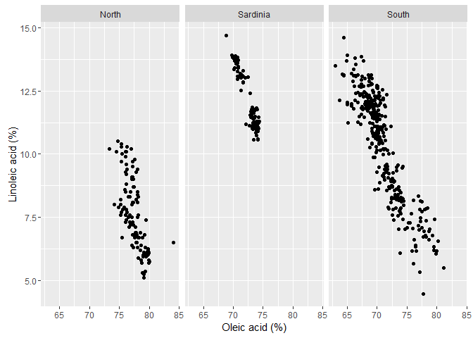
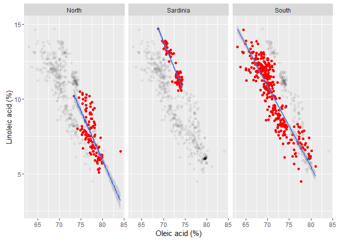

scatterplot
===========

getting started
---------------

We're using the `olives` data set from the `extracat` package. The `olives` data are measurements of fatty acid content in Italian olive oils.

Install `extracat` in the usual fashion, *Packages &gt; Install &gt; extracat*.

Then we can load the packages we're planning to use.

``` r
# packages we'll be using
library(extracat) 
library(ggplot2)
library(dplyr)
```

data
----

``` r
# load the data set
data(olives)

# examine the data 
glimpse(olives)
## Observations: 572
## Variables: 11
## $ Area          <fctr> North-Apulia, North-Apulia, North-Apulia, North...
## $ Region        <fctr> South, South, South, South, South, South, South...
## $ palmitic      <int> 1088, 911, 966, 1051, 911, 1100, 1082, 1037, 105...
## $ palmitoleic   <int> 73, 54, 57, 67, 49, 61, 60, 55, 35, 70, 52, 94, ...
## $ stearic       <int> 224, 246, 240, 259, 268, 235, 239, 213, 219, 214...
## $ oleic         <int> 7709, 8113, 7952, 7771, 7924, 7728, 7745, 7944, ...
## $ linoleic      <int> 781, 549, 619, 672, 678, 734, 709, 633, 605, 747...
## $ linolenic     <int> 31, 31, 50, 50, 51, 39, 46, 26, 21, 50, 41, 42, ...
## $ arachidic     <int> 61, 63, 78, 80, 70, 64, 83, 52, 65, 79, 79, 75, ...
## $ eicosenoic    <int> 29, 29, 35, 46, 44, 35, 33, 30, 24, 33, 32, 31, ...
## $ Test.Training <fctr> Training, Training, Training, Training, Trainin...
```

For our scatterplot explorations, we'll use the data for linoleic acid and oleic acid.

-   Linoleic acid is a polyunsaturated omega-6 fatty acid that makes up about 3.5-21% of olive oil.
-   Oleic acid is a monounsaturated omega-9 fatty acid that makes up 55-83% of olive oil.

graph
-----

The first version of the graph is a straightforward scatterplot.

``` r
# all the data in one panel 
p <- ggplot(data = olives, aes(x = oleic, y = linoleic)) + 
    geom_point()
p
```


There appears to be an inverse relationship between the two acids. Let's add a locally-weighted, low-order-polynomial regression, called a "loess" smooth fit. The gray envelope is a bound on uncertainty.

``` r
# add a loess fitted curve 
p <- p + stat_smooth(method = "loess")
p
```



The loess curve is fairly linear except at the extremes, so if we do a curve fit, a linear fit is probably OK.

``` r
# change to a linear regression 
p <- ggplot(data = olives, aes(x = oleic, y = linoleic)) + 
    geom_point() +
    stat_smooth(method = "lm")
p
```


comparing subsets
-----------------

The data set includes two geographic variables, **Area** and **Region**.

``` r
# examine the Area variable 
summary(olives$Area)
##        Calabria  Coast-Sardinia    East-Liguria Inland-Sardinia 
##              56              33              50              65 
##    North-Apulia          Sicily    South-Apulia          Umbria 
##              25              36             206              51 
##    West-Liguria 
##              50

# examine the Region variable
summary(olives$Region)
##    North Sardinia    South 
##      151       98      323
```

I'm going to condition the data by **Region**. First, I'll leave all the data in one panel, but use color to identify the three regions.

``` r
# identify regions by color 
p <- ggplot(data = olives, aes(x = oleic, y = linoleic, color = Region)) + 
    geom_point()
p
```



Next, I'm going to separate the regions into different panels using `facet_wrap()`.

``` r
# produce one panel per region 
p <- p + facet_wrap(~Region)
p
```


The next version has the same three panels but I plot the full data set underneath the regional data to make it easier to compare the regional data to the other regions overall. First, I create identical regional panels that show all the data from all the regions using a gray data marker.

``` r
# show all the data in every panel
p <- facetshade(data = olives, aes(x = oleic, y = linoleic), f = ~Region) + 
    geom_point(color = alpha("black", 0.05))
p
```


-   `facetshade()` is the function that allows us to print all the data in every panel
-   `f = ...` argument of `facetshade)()` specifies the conditioning variable, in this case, Region.
-   `alpha()` specifies the color transparency level

Next I overprint the regional data only in color.

``` r
# print the data by region in color
p <- p + geom_point(data = olives, color = "red")
p
```



edit for publication
--------------------

I'd like to edit the axis labels to include units, but they aren't given in the data set help page. I think the numbers are in mg of fatty acid per 10 g of oil. For example, the first entry in the oleic acid column is 7709. If that number has units of mg oleic / 10 g oil, then:

7709 mg oleic / 10 g oil
 = 770.9 mg oleic / g oil
 = 0.7709 g oleic / g oil, i.e., gram/gram
 = 77.09%

This percentage is within the expected range of 55-83%. Thus a data value of 7709 is a percentage of 77.09%. I just divide my columns by 100 to obtain fatty acid content as a percentage of the total mass of olive oil.

``` r
# convert the data to a percentage of oil mass 
olives <- olives %>%
    mutate(oleic = oleic/100) %>%
    mutate(linoleic = linoleic/100)
```

New graph with the scales in percent, edit the axis labels, and add an individual regression for each region subset.

``` r
# final version 
p <- facetshade(data = olives, aes(x = oleic, y = linoleic), f = . ~ Region) + 
    geom_point(color = alpha("black", 0.05)) + 
    geom_point(data = olives, color = "red") + 
    labs(x = "Oleic acid (%)", y = "Linoleic acid (%)") + 
    stat_smooth(data = olives, method = "lm")
p
```



That's good enough.

------------------------------------------------------------------------

[main page](../README.md)
