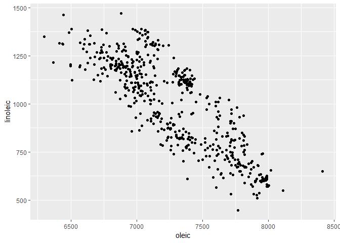
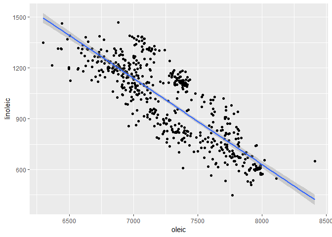
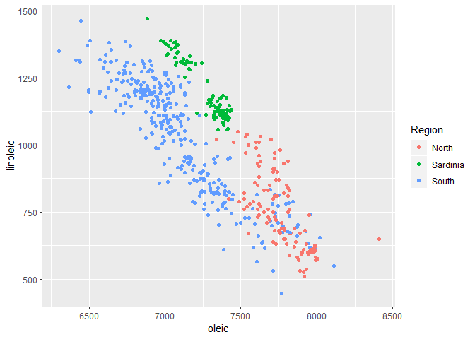
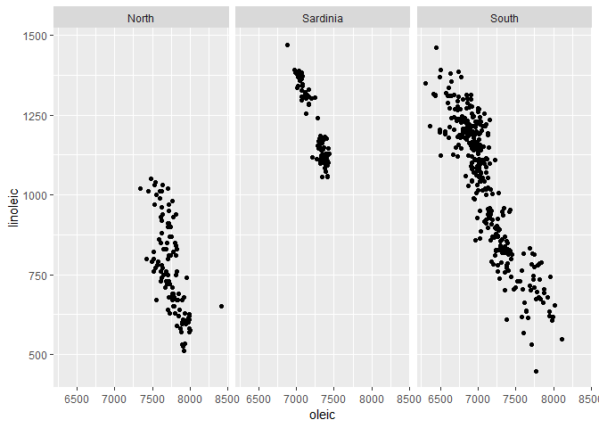
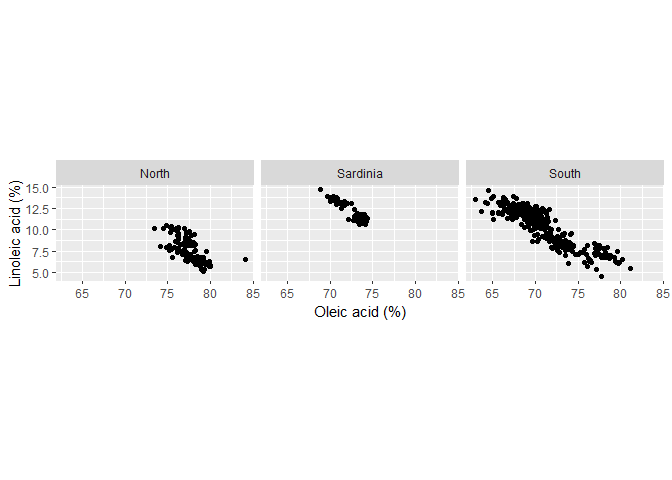
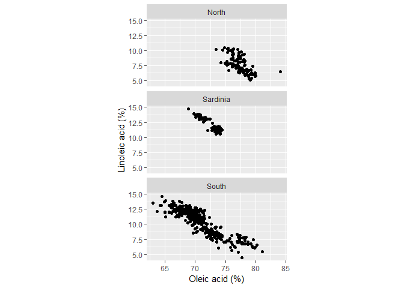
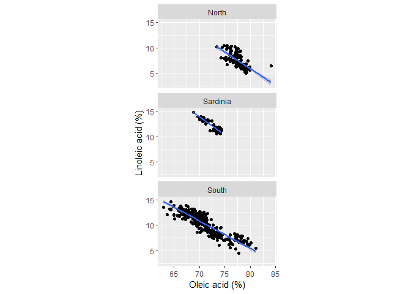

# scatterplot

## getting started

We’re using the `olives` data set from the `extracat` package. The
`olives` data are measurements of fatty acid content in Italian olive
oils.

  - Install `extracat` in the usual fashion, *Packages \> Install \>
    extracat*.
  - Create `scatterplot.Rmd` in your `practiceR/scripts/` directory.
    Write the code chunks in the tutorial with as much of the prose as
    you like to explain the work.

Then we can load the packages we’re planning to use.

<!-- -->

``` r
# packages we'll be using
library(extracat) 
library(ggplot2)
library(dplyr)
```

## data

<!-- -->

``` r
# load the data set
data(olives)

# examine the data 
glimpse(olives)
## Observations: 572
## Variables: 11
## $ Area          <fct> North-Apulia, North-Apulia, North-Apulia, North-...
## $ Region        <fct> South, South, South, South, South, South, South,...
## $ palmitic      <int> 1088, 911, 966, 1051, 911, 1100, 1082, 1037, 105...
## $ palmitoleic   <int> 73, 54, 57, 67, 49, 61, 60, 55, 35, 70, 52, 94, ...
## $ stearic       <int> 224, 246, 240, 259, 268, 235, 239, 213, 219, 214...
## $ oleic         <int> 7709, 8113, 7952, 7771, 7924, 7728, 7745, 7944, ...
## $ linoleic      <int> 781, 549, 619, 672, 678, 734, 709, 633, 605, 747...
## $ linolenic     <int> 31, 31, 50, 50, 51, 39, 46, 26, 21, 50, 41, 42, ...
## $ arachidic     <int> 61, 63, 78, 80, 70, 64, 83, 52, 65, 79, 79, 75, ...
## $ eicosenoic    <int> 29, 29, 35, 46, 44, 35, 33, 30, 24, 33, 32, 31, ...
## $ Test.Training <fct> Training, Training, Training, Training, Training...
```

For our scatterplot explorations, we’ll use the data for linoleic acid
and oleic acid.

  - Linoleic acid is a polyunsaturated omega-6 fatty acid that makes up
    about 3.5-21% of olive oil.
  - Oleic acid is a monounsaturated omega-9 fatty acid that makes up
    55-83% of olive oil.

## graph

The first version of the graph is a straightforward scatterplot.

<!-- -->

``` r
# all the data in one panel 
p <- ggplot(data = olives, aes(x = oleic, y = linoleic)) + 
    geom_point()
p
```

<!-- -->

There appears to be an inverse relationship between the two acids. Let’s
add a locally-weighted, low-order-polynomial regression, called a
“loess” smooth fit. The gray envelope is a bound on uncertainty.

<!-- -->

``` r
# add a loess fitted curve 
p <- p + stat_smooth(method = "loess")
p
```

<!-- -->

The loess curve is fairly linear except at the extremes, so if we do a
curve fit, a linear fit is probably OK.

<!-- -->

``` r
# change to a linear regression 
p <- ggplot(data = olives, aes(x = oleic, y = linoleic)) + 
    geom_point() +
    stat_smooth(method = "lm")
p
```

<!-- -->

## comparing subsets

The data set includes two geographic variables, **Area** and **Region**.

<!-- -->

``` r
# examine the Area variable 
summary(olives$Area)
##        Calabria  Coast-Sardinia    East-Liguria Inland-Sardinia 
##              56              33              50              65 
##    North-Apulia          Sicily    South-Apulia          Umbria 
##              25              36             206              51 
##    West-Liguria 
##              50

# examine the Region variable
summary(olives$Region)
##    North Sardinia    South 
##      151       98      323
```

I’m going to condition the data by **Region**. First, I’ll leave all the
data in one panel, but use color to identify the three regions.

<!-- -->

``` r
# identify regions by color 
p <- ggplot(data = olives, aes(x = oleic, y = linoleic, color = Region)) + 
    geom_point()
p
```

<!-- -->

Next, I’m going to separate the regions into different panels using
`facet_wrap()`.

<!-- -->

``` r
# produce one panel per region 
p <- ggplot(data = olives, aes(x = oleic, y = linoleic)) + 
    geom_point() + 
    facet_wrap(~Region)
p
```

<!-- -->

With regions in separate panels, color coding is no longer needed.

# edit for publication

I’d like to edit the axis labels to include units, but they aren’t given
in the data set help page. I think the numbers are in mg of fatty acid
per 10 g of oil. For example, the first entry in the oleic acid column
is 7709. If that number has units of mg oleic / 10 g oil, then:

7709 mg oleic / 10 g oil  
\= 770.9 mg oleic / g oil  
\= 0.771 g oleic / g oil, i.e., gram/gram  
\= 77.09%

This percentage is within the expected range of 55-83%. Thus a data
value of 7709 actually represents 77.09%. Thus I will divide my columns
by 100 to obtain fatty acid content as a percentage of the total mass of
olive oil.

<!-- -->

``` r
# convert the data to a percentage of oil mass 
olives <- olives %>%
    mutate(oleic = oleic/100) %>%
    mutate(linoleic = linoleic/100)
```

New graph with the scales in percent; edit the axis labels.

<!-- -->

``` r
p <- ggplot(data = olives, aes(x = oleic, y = linoleic)) + 
    geom_point() + 
    facet_wrap(~Region) + 
    labs(x = "Oleic acid (%)", y = "Linoleic acid (%)")
p
```

<!-- -->

With both scales in percent, I would like a 1:1 aspect ratio so that a
5% change on one axis is the same length on the other axis.

<!-- -->

``` r
p <- p + coord_fixed(ratio = 1)
p
```

<!-- -->

That’s sort of squished, so let’s put the panels in a column instead of
a row.

<!-- -->

``` r
p <- p + facet_wrap(~Region, ncol = 1)
p
```

<!-- -->

Lastly, I can add a regression to each panel.

<!-- -->

``` r
p <- p + stat_smooth(data = olives, method = "lm")
p
```

<!-- -->

As always,the graph could have been be drawn in one code chunk, e.g.,

``` r
ggplot(data = olives, aes(x = oleic, y = linoleic)) + 
    geom_point() + 
    facet_wrap(~Region, ncol = 1) + 
    labs(x = "Oleic acid (%)", y = "Linoleic acid (%)") + 
    coord_fixed(ratio = 1) + 
    stat_smooth(data = olives, method = "lm")
```

Some publications are printed in two-column format. To keep the total
page count down (some publications charge authors for extra pages), you
can arrange your panels in a single column like this one and place them
in a single column of the two-column format.

Of course, if you publish electronically, e.g., writing your own blog,
there is no page count nor any page breaks, so you can orient your
figures for onscreen viewing.

-----

[main page](../README.md)
