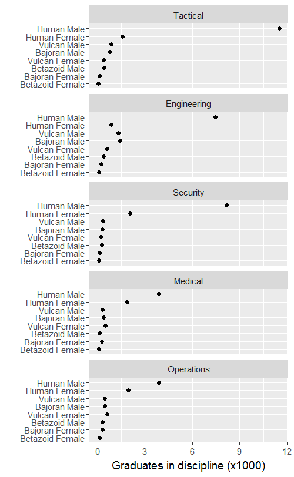

---
output: github_document
--- 

# grouped observations  

```{r cm046-01, echo = FALSE}
library(knitr)
opts_knit$set(root.dir = "../")
opts_chunk$set(echo = TRUE, message = FALSE, warning = FALSE, collapse = TRUE, fig.keep = 'high')
```

```{r cm046-02, echo = FALSE}
# functions for text_icon and code_icon
source("cm/helper_02_icons.R")
```

## getting started 

We are using a database from Starfleet Academy showing the progress of students ever enrolled over a 15 year period. 

- Download the data set from the course repo,  `data/cm047_starfleet-students.csv`. Save it to your  `practiceR/data/` directory. 
- Launch your `practiceR.Rproj` project. 
- Create a `grouping-data.Rmd` in your `practiceR/scripts/` directory. Write the code chunks in the tutorial with as much of the prose as you like  to explain the work. 

```{r}
# packages we'll use
library(readr)
library(dplyr)
library(ggplot2)
```


## data 

Read the file and examine it. 

```{r}
# read the midfield data set 
df0 <- read_csv("data/cm047_starfleet-students.csv") 

# examine it
glimpse(df0)
```

- The data set is already tidy 
- Each row is one student (one observation) 
- All the data are character type (no numbers) 
 
Let's look at each variable (column) in turn. 

The first column is **Sex**. The `table()` function tells us the unique set of entries in the column and how many of each. Here, we find only `Female` and `Male`  because those are the only two sex/gender categories used by the institutions at the time the data were collected. 

```{r}
table(df0$Sex)
```

A quick check: add the two numbers, $`r table(df0$Sex)[[1]]` + `r table(df0$Sex)[[2]]` =  `r sum(table(df0$Sex))`$, which agrees with the number of observations reported in the `glimpse()` above. 

The **Species** variable has four possible values, indicating that any students not in these four classifications have been omitted from the data set. 

```{r}
table(df0$Species)
```

Repeat the quick check: the sum of the 4 numbers is `r sum(table(df0$Species))`, again, as expected. 

The **Start** variable indicates the disciplinary track the students declared when they started at the Academy.  

```{r}
table(df0$Start)
```

The **Finish** variable states the student destination after 6 years, either the major in which they graduated or `Resigned` if they resigned or washed out.  

```{r}
table(df0$Finish)
```

The **Transfer** variable value `yes` means that students transferred into the academy from another institution off-planet; `no` means that they were not a transfer student.  

```{r}
table(df0$Transfer)
```

We don't see any NA values in the columns, but to be sure, let's check for complete cases: 

```{r}
unique(complete.cases(df0))
```

Had even one observation been incomplete, the `unique()` function would have returned both a `TRUE` (for complete cases) and `FALSE` (for incomplete cases). I conclude that every observation is complete (no entries blank or missing). 

## counting

In a data set like this one, we often want to answer a question, "How many students do X?" where "X" could be "started in a discipline", "graduated in a discipline", "switched disciplines", etc. 

With a data set this large, we can also disaggregate by Sex, Species, Discipline, and Transfer status. Thus a question could be more detailed, e.g., "In Operations, do Female graduation rates differ by Species and Transfer status?" 

To answer questions like these, we have to count how many students are in a category. The `dplyr` package simplifies the process with its `group_by()` and `summarize()` functions. 

For example, let's count the number of Males and Females across all species. The result should match the results we got from `table()` earlier. 

```{r}
# count by sex only 
my_grouping <- group_by(df0, Sex)
df1         <- summarize(my_grouping, Count = n())
```

- `n()` returns the number of instances (or frequency) of the grouped value 
- `Count` is an arbitrary label for the new column, as seen when I print the new data frame `df1` below 

```{r}
# print the result
df1
```

We could have grouped by Species.

```{r}
# count by ethnicity 
my_grouping <- group_by(df0, Species)
df2         <- summarize(my_grouping, Count = n())

# result
df2
```

Next, let's count by Sex and Species. 

```{r}
# count by sex and ethnicity 
my_grouping <- group_by(df0, Sex, Species)
df3         <- summarize(my_grouping, Count = n())

# print the result
df3
```

Or, by Sex and Discipline at graduation. 

```{r}
# count by sex and finish  
my_grouping <- group_by(df0, Sex, Finish)
df3         <- summarize(my_grouping, Count = n())

# print the result
df3
```


As you can see, we can group by any combination of variables we are interested in.  

## example 

Suppose we want to compare the demographic distribution of students by Sex and Species at graduation in 5 most popular disciplines (Tactical, Engineering, Security, Medical, and Operations). In other words, what does the graduating class in each discipline look like? 

We start by subsetting the data for these majors only. 

```{r}
df4 <- df0 %>%
	filter(Finish %in% c("Tactical", "Engineering", "Security", "Medical", "Operations"))
```

Next, let's combine Sex and Species into a single variable called `Specgen`. 

```{r}
df4 <- df4 %>%
	mutate(Specgen = paste(Species, Sex)) %>%
	select(Specgen, Finish) 

glimpse(df4)
```

I kept only the two columns `Specgen` and `Finish`. Note the number of observations is `r dim(df4)[1]`. Each row is still one student. 

Now we can count using the `group_by()` and `summarize()`functions from `dplyr`. 

```{r}
# count by sex only 
my_grouping <- group_by(df4, Specgen, Finish)
df5         <- summarize(my_grouping, Count = n())

# examine the result
glimpse(df5)
```

The number of observations is `r dim(df5)[1]` because by summarizing, we now have `r length(unique(df5$Specgen))` Species groups in each of `r length(unique(df5$Finish))` disciplines.

Before graphing the data, I know we'll want to order the rows and panels by the counts. So we convert the character variables to factors and order them by count (a topic covered in detail in the line graph tutorial).  

```{r}
# make the two categorical vectors into factors, ordered by count
df5$Specgen <- factor(df5$Specgen, 
  levels = unique(df5$Specgen[order(df5$Count)])
  )

df5$Finish <- factor(df5$Finish, 
  levels = unique(df5$Finish[order(df5$Count)])
  )
```

I'd like to use this data frame in a subsequent tutorial, so I'll write it to file. 

```{r}
write_csv(df5, "data/cm047_starfleet-students-top5.csv")
```


## graph 

A dot plot is suitable for these type of data. The sex/ethnicity groups are the rows, the major is the panel (conditioning variable) and the number of students is the the common horizontal scale. 

```{r}
fig <- ggplot(data = df5, aes(x = Count/1000, y = Specgen)) + 
	geom_point() + 
	facet_wrap(~Finish, ncol = 1) + 
	labs(x = "Graduates in discipline (x1000)", y = "")

ggsave("results/cm047_destinations.png", plot = fig, 
             width = 4, height = 6.5, units = "in", dpi = 125)
```

 

--- 
[main page](../README.md)
