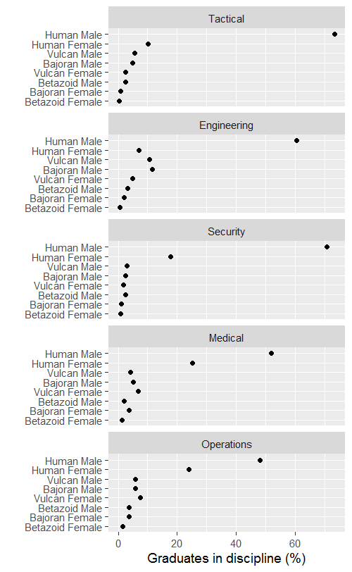

joining data frames
===================

getting started
---------------

The data is a summary CSV file you created in an earlier tutorial using the Starfleet students data set.

``` r
# packages we'll use
library(readr)
library(dplyr)
library(ggplot2)
```

data
----

Read in the data file.

``` r
# read in the data 
df1 <- read_csv("data/cm047_starfleet-students-top5.csv")
```

In the earlier tutorial we had converted the character variables to factors. But when we use `write_csv()`, the factor integer encoding is left behind. Thus when we read in the data now, both **Specgen** and **Finish** are character variables.

``` r
# examine it 
glimpse(df1)
## Observations: 40
## Variables: 3
## $ Specgen <chr> "Bajoran Female", "Bajoran Female", "Bajoran Female", ...
## $ Finish  <chr> "Engineering", "Medical", "Operations", "Security", "T...
## $ Count   <int> 242, 274, 303, 130, 135, 1436, 387, 475, 304, 774, 67,...
```

group and summarize
-------------------

We have a count of the number of graduates of each Species/Sex group in each discipline

Suppose we would like to express those counts as percentages of the total number of graduates in each discipline To find the totals, we do another grouping to find the total number of students graduating in each discipline.

``` r
# group by the Discipline in Finish 
my_grouping <- group_by(df1, Finish)

# summarize by aggregating all students in a discipline 
by_dspn <- dplyr::summarize(my_grouping, Count_dspn = sum(Count))
```

-   `group_by()` groups the original data frame by the discipline, i.e., **Finish**
-   `my_grouping` is the new grouped data frame
-   `summarize()` operates on `my_grouping` creating a new data frame `by_dspn`
-   `sum()` operates on **Count** (from the `my_grouping` data frame) and assigns the totals to **Count\_dspn** (in the `by_dspn` data frame)

``` r
# examine the result
by_dspn
## # A tibble: 5 × 2
##        Finish Count_dspn
##         <chr>      <int>
## 1 Engineering      12384
## 2     Medical       7501
## 3  Operations       8114
## 4    Security      11576
## 5    Tactical      15704
```

The new data frame `by_dspn` has one row per discipline and only two columns:

-   **Finish** because it was the variable we grouped by
-   **Count\_dspn** because it was the sum we created

join
----

Recall the original data frame,

``` r
df1
## # A tibble: 40 × 3
##           Specgen      Finish Count
##             <chr>       <chr> <int>
## 1  Bajoran Female Engineering   242
## 2  Bajoran Female     Medical   274
## 3  Bajoran Female  Operations   303
## 4  Bajoran Female    Security   130
## 5  Bajoran Female    Tactical   135
## 6    Bajoran Male Engineering  1436
## 7    Bajoran Male     Medical   387
## 8    Bajoran Male  Operations   475
## 9    Bajoran Male    Security   304
## 10   Bajoran Male    Tactical   774
## # ... with 30 more rows
```

Adjacent to **Count** I want to add a new column **Count\_dspn** with the totals from `by_dspn`. For example, every row of `df1` that has `Engineering` in **Finish** would have a value of 12384 in the new column. That total comes from the `Engineering` row of `by_dspn`:

``` r
by_dspn
## # A tibble: 5 × 2
##        Finish Count_dspn
##         <chr>      <int>
## 1 Engineering      12384
## 2     Medical       7501
## 3  Operations       8114
## 4    Security      11576
## 5    Tactical      15704
```

Copying the totals from `by_dspn` into a new column in `df1` and matching the correct rows by major is called *joining*.

We join data frames by telling R to match rows "by" the values in columns that the two data frames have in common, in this case, the **Finish** column. We're doing what's called a *left join*, where the operation returns all rows from `df1` and all the columns from both `df1` and `by_dspn`.

``` r
# join the majors totals to the original data frame
df2 <- left_join(df1, by_dspn, by = "Finish")

# examine the result
df2
## # A tibble: 40 × 4
##           Specgen      Finish Count Count_dspn
##             <chr>       <chr> <int>      <int>
## 1  Bajoran Female Engineering   242      12384
## 2  Bajoran Female     Medical   274       7501
## 3  Bajoran Female  Operations   303       8114
## 4  Bajoran Female    Security   130      11576
## 5  Bajoran Female    Tactical   135      15704
## 6    Bajoran Male Engineering  1436      12384
## 7    Bajoran Male     Medical   387       7501
## 8    Bajoran Male  Operations   475       8114
## 9    Bajoran Male    Security   304      11576
## 10   Bajoran Male    Tactical   774      15704
## # ... with 30 more rows
```

Every row with the same discipline has the same total in the new column.

compute percentages
-------------------

Now that we have total numbers of graduates by discipline, we can compute the percentage of totals for each Species/Sex group. I've rounded the percentages to one place.

``` r
# compute population fractions 
df2 <- df2 %>%
    mutate(Percent = round(100 * Count / Count_dspn, 1))

# arrange by major and percentages
df2 <- df2 %>%
    arrange(Finish, desc(Percent))

# have a look
df2
## # A tibble: 40 × 5
##            Specgen      Finish Count Count_dspn Percent
##              <chr>       <chr> <int>      <int>   <dbl>
## 1       Human Male Engineering  7476      12384    60.4
## 2     Bajoran Male Engineering  1436      12384    11.6
## 3      Vulcan Male Engineering  1305      12384    10.5
## 4     Human Female Engineering   873      12384     7.0
## 5    Vulcan Female Engineering   597      12384     4.8
## 6    Betazoid Male Engineering   388      12384     3.1
## 7   Bajoran Female Engineering   242      12384     2.0
## 8  Betazoid Female Engineering    67      12384     0.5
## 9       Human Male     Medical  3898       7501    52.0
## 10    Human Female     Medical  1889       7501    25.2
## # ... with 30 more rows
```

graph
-----

The graph will be similar to the previous graph, so we'll want the groups and majors to be factors. The graph will display percentages, but the rows and panels are still ordered by **Count**, i.e., the numbers of students in the categories.

``` r
# make the two categorical vectors into factors, ordered by count
df2$Specgen <- factor(df2$Specgen, 
  levels = unique(df2$Specgen[order(df2$Count)])
  )

df2$Finish <- factor(df2$Finish, 
  levels = unique(df2$Finish[order(df2$Count)])
  )
```

And graph.

``` r
fig <- ggplot(data = df2, aes(x = Percent, y = Specgen)) + 
    geom_point() + 
    facet_wrap(~Finish, ncol = 1) + 
    labs(x = "Graduates in discipline (%)", y = "")

ggsave("results/cm048_destinations.png", plot = fig, 
             width = 4, height = 6.5, units = "in", dpi = 125)
```



------------------------------------------------------------------------

[main page](../README.md)
