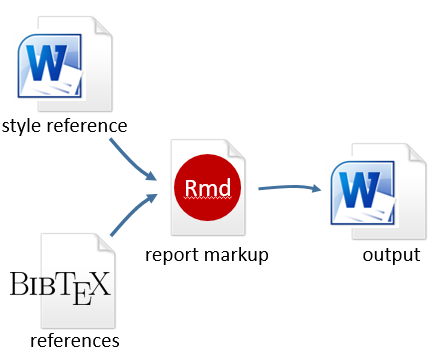

```{r include=FALSE}
library(knitr)
opts_knit$set(root.dir = "../")
opts_chunk$set(out.width = "350px")
```

# references and citations 

```{r, echo=FALSE}

```

We will use the bib format (from BiBTeX) for bibliographies. The  basic steps are: 

- Create the bib file  
- Specify the bib file in the YAML header of the Rmd script
- Add the citation to the report  
- Add a references heading 


## create the bib file

To create the bib file:

- Open a new text file in RStudio, *File &gt; New File &gt; Text File*
- *Save As* `project_name.bib` in the `resources` directory


## create reference entries in the bib file

You will type references into the `.bib` file something like this, where 

- `@manual` denotes a specific document type, e.g., article, book, etc. 
- `ansi-isa-1995` is a reference label you assign here to be used later in the citation 
- Each reference type has a few required arguments and other arguments are  optional


```{r, echo=FALSE, out.width = "500px"}
include_graphics("../resources/images/bib-details.png")
```

<!-- <pre class="r"><code>@manual{ansi-isa-1995, -->
<!--     title        = {Process instrumentation terminology}, -->
<!--     edition      = {ANSI/ISA-S51.1-1979, reaffirmed 1995}, -->
<!--     organization = {Instrument Society of America}, -->
<!--     address      = {Research Triangle Park, NC}, -->
<!--     year         = {1995}, -->
<!--     note         = {ISBN 0-87664-390-4}, -->
<!-- }</code></pre> -->


For help in formatting the entries in the bib file by article type, e.g., article, proceedings, book, manual, etc., try the  [verbosus](https://verbosus.com/bibtex-style-examples.html) site.


## forcing capitalization when needed

References are sometimes not capitalized the way you expect. Return to the `.bib` file and place braces `{}` around letters you want capitalized.

For example,

```
@book{gandrud2015,
  author    = {Christopher Gandrud},
  title     = {Reproducible {R}esearch with {R} and {RS}tudio},
  publisher = {CRC Press},
  year      = {2015},
  address   = {Boca Raton, FL},
  edition   = {2},
}
```


## specify the bib file in the YAML header

Add the bibliography argument to the front matter including the relative path if needed.

<pre class="r"><code>---
title: "Load-cell calibration report"
author: "name"
date: "date"
output: word_document
bibliography: "../resources/project_name.bib"
---</code></pre>


## add the citation to the report

- Citation syntax has the form `[@ref_label]` 
- `ref_label` is the reference label you assigned in the bib file


In the report Rmd file, add the citation at the appropriate location in the paragraph, for example,

<pre class="r"><code>The test procedure follows the ANSI/ISA standard [@ansi-isa-1995].
</code></pre>

When you knit the document, the citation is automatically formatted.

> The test procedure follows the ANSI/ISA standard (*Process Instrumentation
Terminology* 1995).


## add a references heading

At the end of the Rmd script, add a references section heading.

<pre class="r"><code># References
</code></pre>

All references cited in your report will be automatically formatted and listed here, at the end of the report, for example, 

> *References*
>
> *Process Instrumentation Terminology*. 1995. ANSI/ISA-S51.1-1979,
reaffirmed 1995. Research Triangle Park, NC: Instrument Society of America.


## changing the format

Citations and references are both formatted automatically. To change the format, we use a CSL file. You don't have to create one. Just find the one that meets your needs online and download it.

- Find a [CSL style file](http://citationstyles.org/styles/) that suits your needs, for example `chicago-author-date.csl` or `ieee.csl`
- Download the CSL file and save it in your `resources/` folder
- Edit the YAML header to designate the CSL style file you wish to use.

<pre class="r"><code>---
title: "Load-cell calibration report"
author: "name"
date: "date"
output: word_document
bibliography: "../resources/project_name.bib"
csl: "../resources/chicago-author-date.csl"
---</code></pre>


