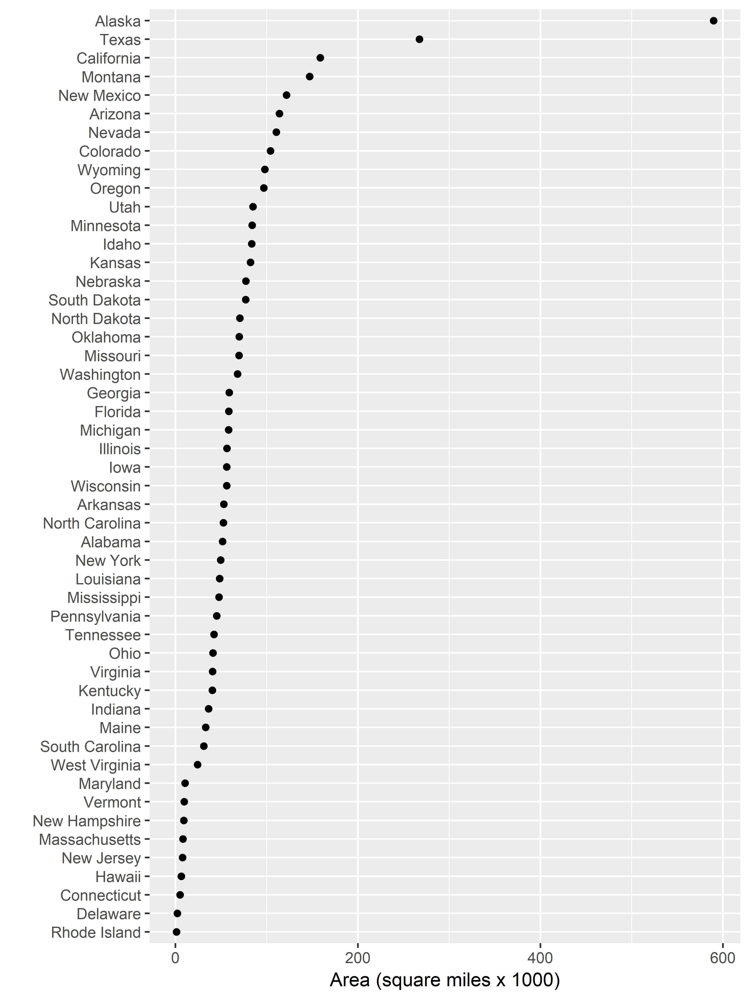

---
output: github_document
bibliography: "../resources/bib-etc/references-rr.bib"
csl: "../resources/styles/apa.csl"
--- 


# dot plot  

```{r setup, echo = FALSE}
library(knitr)
opts_knit$set(root.dir = "../")
opts_chunk$set(echo = TRUE, message = FALSE, warning = FALSE, collapse = TRUE)
```


The *dot plot* by Bill Cleveland is a preferred substitute for data typically shown in pie charts or bar charts [@robbins2013]. Dot plots are suitable for data that have the following attributes:  

- One quantitative variable  
- One categorical variable, often encoded as a factor 
- Optional: the data may include additional factors that we can use for creating graph facets  

Recall that in R, factors are categorical variables that have been encoded with a fixed and known set of possible values. 


## data 

Create `dot_plot.Rmd` in your `practice_work/exercises/` directory. Write the code chunks in the tutorial with as much of the prose as you like  to explain the work. 

```{r}
library(tidyverse)
library(forcats)
```

The base R installation includes US `state` data with all data arranged according to alphabetical order of the state names. (Learn more by typing `?state`  in your console.) I have tidied the data somewhat and saved it to the course data directory on GitHub as `data/cm5017_state.csv`. You can download the file and save it in your `practice_work/data/` directory. 


Once the file is saved on your machine, read the file with your Rmd script. 

```{r}
df <- read_csv('data/cm5017_state.csv')
glimpse(df)
```

You can see we have variable types: character, integer, and double. 


## dot plot

Suppose we want to compare the areas of the states.  

- one quantitative variable, `area` 
- one categorical variable, `name` 

```{r}
ggplot(df, aes(x = area, y = name)) +
	geom_point()
```


With area values in the hundreds of thousands of square miles, the graph scale will easier to read if we display in thousands of square miles. Of course, when scaling the axis units like this, I should also add an axis label to indicate the scaling. 

```{r}
# create a new column with area in 1000s of sq mi
df <- df %>%
	mutate(scaled_area = area / 1000)

ggplot(df, aes(x = scaled_area, y = name)) +
	geom_point() +
	labs(x = "Area (square miles x 1000)", y = "")
```

The state names are a character variable so they are ordered alphabetically on the y-axis. 


## row ordering with factors

We prefer to order the state names by the state area. First, we'll show that name is presently a character variable. 

```{r}
typeof(df$name)
```

Following the example in [section 15.4](http://r4ds.had.co.nz/factors.html#modifying-factor-order) in the text  [@wickhamgrolemund2016], we encode the state names as factors, ordered by area. 

```{r}
df <- df %>% 
  mutate(name = fct_reorder(name, scaled_area))	
```

`glimpse()` shows us that name is now a factor with 50 levels. 

```{r}
glimpse(df$name)
```

Recall that factors are encoded behind the scenes as integers $1, ..., n$. `typeof()` reveals the existence of the integers now associated with the state names.    

```{r}
# after fct_reorder(), name is an integer type
typeof(df$name)
```

The order of the integers $1, ..., n$ is the order of the levels. Using `levels()`, we see that  level 1 is Rhode Island (the smallest area) and level 50 is Alaska (the largest area). 

```{r}
levels(df$name)
```

Now, using the same plot commands as before, the state names are ordered by area. 

```{r}
ggplot(df, aes(x = scaled_area, y = name)) +
	geom_point() +
	labs(x = "Area (square miles x 1000)", y = "")
```

That's better, but the rows are too close together, so we need to control the figure size. 


## figure sizing

When creating graphs in stand-alone R scripts from your `scripts` directory, you would typically write your graph to file using `ggsave()` or possibly `png()`. 

In either case, you can set the resolution in dpi and the figure size. 

```{r}
ggsave(filename = "cm5019-states.png", 
    path   = "results",
    width  = 6, 
    height = 8, 
    units  = "in", # "in", "cm", or "mm"
    dpi    = 600)
```


Then import the figure into the R Markdown document using `knitr::include_graphics()`. 

```{r}

```

I can control the screen view by using the `out.width` argument of the knitr code chunk.  

<pre class="r"><code>```{r out.width = "70%"}

<code>```</code>
</code></pre>


```{r out.width = "70%", echo=FALSE}

```


## a second categorical variable

Suppose we want to compare the areas of the states by region.  

- one quantitative variable, `area` 
- one categorical variable, `name` 
- a second categorical variable, `region` 

The values for region are:

```{r}
unique(df$region)
typeof(df$region)
```

So we have four regions and I want to encode them as factors, ordered by the total area of all states in the region. 


```{r fig.height=8}
df <- df %>% 
  mutate(region = fct_reorder(region, scaled_area, sum))

# view the results 
glimpse(df$region)

levels(df$region)
```

Thus `region` is now a factor with `"Northeast"`at level 1 (the smallest total area) and `"West"` at level 4 (largest total area). 


Graph again, adding `facet_grid()` to create one panel per region. We set the `as.table = FALSE` argument to arrange the levels 1 through 4 from bottom to top. (With  `as.table = TRUE`, the levels are arranged in "table" order, from level 1 to level 4 from top to bottom.) 
 
```{r}
f1 <- ggplot(df, aes(x = scaled_area, y = name)) +
  geom_point() +
  labs(x = "Area (square miles x 1000)", y = "") + 
  facet_grid(rows = vars(region), 
      as.table = FALSE)

print(f1)
```

Ouch, that's ugly.

There a lot of blank rows because a state can be a member of only one region. To eliminate the names that don't exist in a region, we add the `scales = "free_y"` argument. 

```{r fig.height=8}
f2 <- f1 +
  facet_grid(rows = vars(region), 
      as.table = FALSE, 
      scales = "free_y")

print(f2)
```

That's better. However, because all the facets have the same height and the regions have different numbers of states, the gap between rows is different in every facet. To allow the panel heights to self-adjust for equal row spacing, we add the `space = "free"` argument.

```{r fig.height=8}
f3 <- f2 + 
  facet_grid(rows = vars(region), 
      as.table = FALSE, 
      scales = "free_y", 
      space = "free")

print(f3)
```

Pretty neat!


<!-- ## graphics for communication  -->

<!-- Before sharing the graph with an audience, we might make a few more aesthetic edits. Most of these changes are described in [Chapter 28](http://r4ds.had.co.nz/graphics-for-communication.html) of the text.  -->

<!-- First, to help the reader to read the facet headings, we can  -->

<!-- - `theme(strip.text = element_blank())` to delete the vertical panel titles  -->
<!-- - `geom_text()` to label the regions inside each facet  -->
<!-- - `labs(y = "")`  to delete the y-axis title  -->


<!-- ```{r fig.height=8} -->
<!-- f2 <- f1 +  -->
<!--   labs(x = "Area (square miles x 1000)", y = "") +  -->
<!-- 	theme(strip.text = element_blank()) + -->
<!--   geom_text(data = df, aes(x = 600, y = 2, label = region),  -->
<!--   					size = 6, hjust = "right", color = "gray55") -->

<!-- f2 -->
<!-- ``` -->

<!-- Use a theme to revise the overall look of the graph. -->

<!-- ```{r fig.height=8} -->
<!-- f3 <- f2 + -->
<!-- 	theme_light() +  -->
<!--   theme(strip.text = element_blank()) -->

<!-- f3 -->
<!-- ``` -->


## references

<!-- Figure 4.3 is from Robbins and the `ggplot2` code is adapted from Zhao & Bryan.   -->

<!-- 1. Naomi Robbins (2013) [*Creating More Effective Graphs*](http://www.nbr-graphs.com/resources/recommended-books/), Chart House.      -->
<!-- 2. Joanna Zhao and Jenny Bryan,  [r-graph-catalog](https://github.com/jennybc/r-graph-catalog), providing ggplot2 scripts for nearly all of the graphs in Robbins' book.     -->
<!-- 3. Winston Chang, [Facets (ggplot2)](http://www.cookbook-r.com/Graphs/Facets_(ggplot2)), [Cookbook for R](http://www.cookbook-r.com/).   -->


