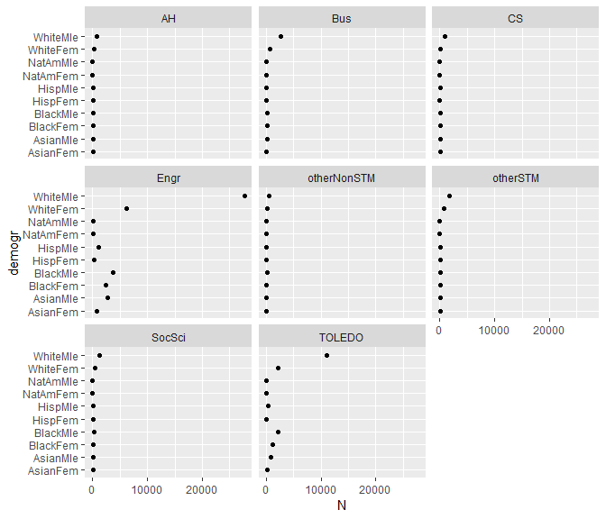
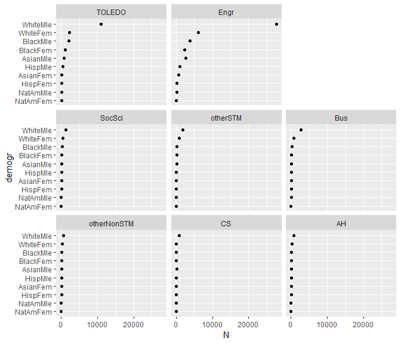
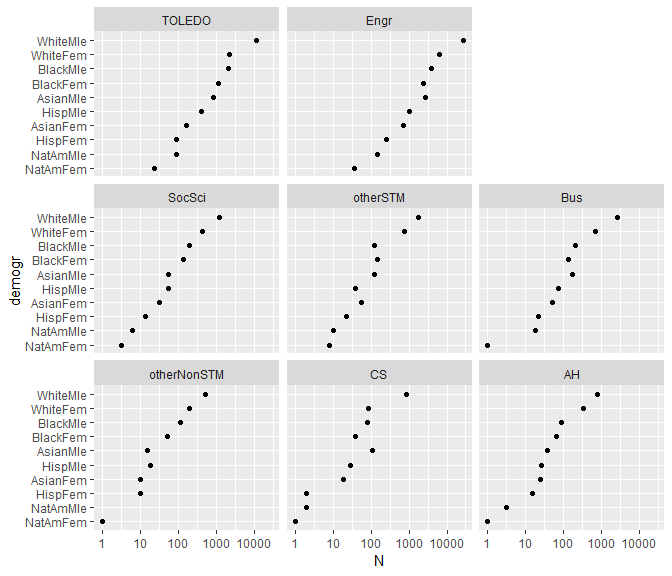
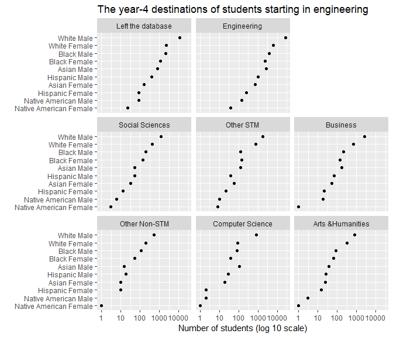

# multiway graphs

Multiway data have a specific structure

  - a categorical variable with *m* levels
  - a second categorical variable with *n* levels
  - a quantitative variable with *m x n* values, one value for each
    combination of the two categories

## data

Create `multiway.Rmd` in your `practice_work/exercises/` directory.
Write the code chunks in the tutorial with as much of the prose as you
like to explain the work.

``` r
library(tidyverse)
library(forcats)
```

An untidy data file `midfield-student-data.csv` adapted from (Layton,
Lord, & Ohland, 2009) is saved to the course data directory on GitHub.
You can download the file and save it in your `practice_work/data/`
directory. Once the file is saved on your machine, read the file with
your Rmd script.

``` r
df1 <- read_csv('data/midfield-student-data.csv')

glimpse(df1)
## Observations: 8
## Variables: 11
## $ DestMajor <chr> "AH", "Bus", "CS", "Engr", "otherNonSTM", "otherSTM"...
## $ AsianFem  <int> 25, 52, 19, 699, 10, 56, 31, 162
## $ AsianMle  <int> 38, 166, 110, 2716, 15, 124, 53, 803
## $ BlackFem  <int> 66, 137, 39, 2363, 52, 143, 134, 1113
## $ BlackMle  <int> 85, 208, 82, 3788, 109, 125, 192, 2112
## $ HispFem   <int> 15, 21, 2, 250, 10, 22, 13, 88
## $ HispMle   <int> 26, 71, 29, 1011, 18, 39, 53, 406
## $ NatAmFem  <int> 1, 1, 1, 37, 1, 8, 3, 23
## $ NatAmMle  <int> 3, 18, 2, 148, 0, 10, 6, 85
## $ WhiteFem  <int> 329, 689, 87, 6182, 195, 774, 413, 2213
## $ WhiteMle  <int> 791, 2688, 836, 27722, 523, 1774, 1227, 10995
```

Multiway data are often displayed in a wide table. The *m* levels of the
first category are in the rows of first column; the *n* levels of the
second category are in the other column headings; and the *m x n* values
of the quantitative variable fill the table cells—no cell is
empty.

``` r
kable(df1)
```

| DestMajor   | AsianFem | AsianMle | BlackFem | BlackMle | HispFem | HispMle | NatAmFem | NatAmMle | WhiteFem | WhiteMle |
| :---------- | -------: | -------: | -------: | -------: | ------: | ------: | -------: | -------: | -------: | -------: |
| AH          |       25 |       38 |       66 |       85 |      15 |      26 |        1 |        3 |      329 |      791 |
| Bus         |       52 |      166 |      137 |      208 |      21 |      71 |        1 |       18 |      689 |     2688 |
| CS          |       19 |      110 |       39 |       82 |       2 |      29 |        1 |        2 |       87 |      836 |
| Engr        |      699 |     2716 |     2363 |     3788 |     250 |    1011 |       37 |      148 |     6182 |    27722 |
| otherNonSTM |       10 |       15 |       52 |      109 |      10 |      18 |        1 |        0 |      195 |      523 |
| otherSTM    |       56 |      124 |      143 |      125 |      22 |      39 |        8 |       10 |      774 |     1774 |
| SocSci      |       31 |       53 |      134 |      192 |      13 |      53 |        3 |        6 |      413 |     1227 |
| TOLEDO      |      162 |      803 |     1113 |     2112 |      88 |     406 |       23 |       85 |     2213 |    10995 |

Categorical variable 1—a student’s major after 4 years—has 8 levels:

  - Arts and Humanities
  - Business
  - Computer Science
  - Engineering
  - Other Non-STM disciplines (STM: Science, Technology, and Math)
  - Other STM disciplines
  - Social Sciences
  - TOLEDO: Destination unknown (left the dataset)

Categorical variable 2—a student’s race/ethinicty and sex—has 10 levels:

  - Asian American Female and Male
  - Black (African American) Female and Male
  - Hispanic (Latin) Female and Male
  - Native American Female and Male
  - White (non-Hispanic) Female and Male

Quantitative variable has 8 x 10 = 80 values

  - Number of students enrolled in a major for each race/ethnicity/sex
    group

## tidying the data

Use *gather()* to tidy the data (wide form to long form).

``` r
df2 <- df1 %>%
    gather(demogr, N, AsianFem:WhiteMle)

glimpse(df2)
## Observations: 80
## Variables: 3
## $ DestMajor <chr> "AH", "Bus", "CS", "Engr", "otherNonSTM", "otherSTM"...
## $ demogr    <chr> "AsianFem", "AsianFem", "AsianFem", "AsianFem", "Asi...
## $ N         <int> 25, 52, 19, 699, 10, 56, 31, 162, 38, 166, 110, 2716...
```

Save the tidy data as a new CSV file in your `data/` directory.

``` r
write_csv(df2, 'data/midfield-student-data-tidy.csv')
```

## graphing multiway data

Read the tidy CSV data file from your data directory.

``` r
df3 <- read_csv('data/midfield-student-data-tidy.csv')

glimpse(df3)
## Observations: 80
## Variables: 3
## $ DestMajor <chr> "AH", "Bus", "CS", "Engr", "otherNonSTM", "otherSTM"...
## $ demogr    <chr> "AsianFem", "AsianFem", "AsianFem", "AsianFem", "Asi...
## $ N         <int> 25, 52, 19, 699, 10, 56, 31, 162, 38, 166, 110, 2716...
```

Plot it with rows (y) the demographic category and facets the
destination major category. The x-variable is the number of students N.

``` r
f1 <- ggplot(df3, aes(x = N, y = demogr)) +
    geom_point() +
    facet_wrap(vars(DestMajor), ncol = 3)

print(f1)
```

<!-- -->

The multiway categorical variables must be recoded as factors that are
ordered by N.

``` r
df3 <- df3 %>% 
  mutate(demogr = fct_reorder(demogr, N, sum)) %>%
  mutate(DestMajor = fct_reorder(DestMajor, N, sum))
```

``` r
f3 <- ggplot(df3, aes(x = N, y = demogr)) +
  geom_point() +
  facet_wrap(vars(DestMajor), ncol = 3, as.table = FALSE)

print(f3)
```

<!-- -->

## applying a log scale

With data spanning several orders of magnitude, a logarithmic scale let
us see small and large differences.

``` r
f3 <- f3 + scale_x_log10()
print(f3)
```

<!-- -->

Your console may show a warning message about a transformation error.

    Warning message:
    Transformation introduced infinite values in continuous x-axis 

The warning was issued because I tried to graph log(0) which is
undefined. We can filter the data to keep only those rows with
\(N > 0\).

``` r
df4 <- df3 %>%
  filter(N > 0)

# how many observations did we lose?
glimpse(df4)
## Observations: 79
## Variables: 3
## $ DestMajor <fct> AH, Bus, CS, Engr, otherNonSTM, otherSTM, SocSci, TO...
## $ demogr    <fct> AsianFem, AsianFem, AsianFem, AsianFem, AsianFem, As...
## $ N         <int> 25, 52, 19, 699, 10, 56, 31, 162, 38, 166, 110, 2716...
```

## using %+% to replace a current data frame

We want to use the data frame `df4` that has been filtered to remove
entries with \(N = 0\).

We replace a data frame in a ggplot graph we’ve already defined using
the `%+%` operator—similar to using `+` to add a new layer.

``` r
f4 <- f3 %+% df4 
print(f4)
```

<!-- -->

## recoding row and panel labels

In preparing the graph for sharng with others, we will typically replace
the categorical levels with easier to read labels. Following the
suggestion is
[section 15.5](http://r4ds.had.co.nz/factors.html#modifying-factor-levels)
of the text (Wickham & Grolemund, 2016):

``` r
df5 <- df4 %>% 
  mutate(demogr = fct_recode(demogr,
    "Asian Male"           = "AsianMle",
    "Asian Female"         = "AsianFem",
    "Black Male"           = "BlackMle",
    "Black Female"         = "BlackFem",
    "Hispanic Male"        = "HispMle",
    "Hispanic Female"      = "HispFem",
    "Native American Male" = "NatAmMle",
    "Native American Female" = "NatAmFem", 
    "White Male"           = "WhiteMle",
    "White Female"         = "WhiteFem"
  )) %>% 
  mutate(DestMajor = fct_recode(DestMajor,
    "Arts &Humanities"  = "AH",
    "Business"          = "Bus",
    "Computer Science"  = "CS",
    "Engineering"       = "Engr",
    "Other Non-STM"     = "otherNonSTM",
    "Other STM"         = "otherSTM",
    "Left the database" = "TOLEDO",
    "Social Sciences"   = "SocSci", 
  ))

# replace df and add labels 
f5 <- f4 %+%
    df5 +
  labs(x = "Number of students (log 10 scale)", 
      y = "", 
      title = "The year-4 destinations of students starting in engineering")
    
print(f5)
```

<!-- -->

## the dual multiway

In a multiway graph, numbers in a panel are more easily compared than
numbers in different panels.

Every multiway has dual form in which we swap the categories—rows become
panels and panels become rows. All we have to do is change the variables
assigned to `y` and `facet`.

``` r
f6 <- ggplot(df5, aes(x = N, y = DestMajor)) +
    geom_point() +
    facet_wrap(vars(demogr), ncol = 3, as.table = FALSE) +
    scale_x_log10() + 
    labs(x = "Number of students (log 10 scale)", 
      y = "", 
      title = "The year-4 destinations of students starting in engineering")

print(f6)
```

<!-- -->

## references

<div id="refs">

<div id="ref-layton2009">

Layton, R., Lord, S., & Ohland, M. (2009). Reasoning about categorical
data: Multiway plots as useful research tools. In *ASEE annual
conference*. Austin, TX.

</div>

<div id="ref-wickhamgrolemund2016">

Wickham, H., & Grolemund, G. (2016). *R for Data Science*. Sebastopol,
CA: O’Reilly Media, Inc.

</div>

</div>

<!-- other stuff can go after -->
