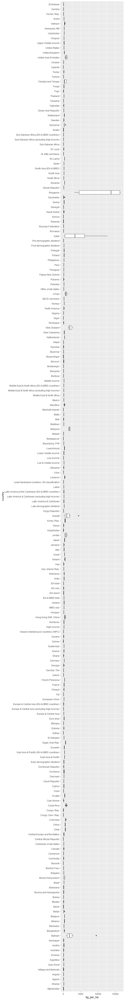
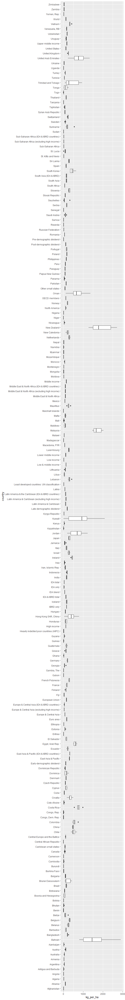

# data preparation

These exercises are based on Chapter 7 of (Gandrud,
[2014](#ref-gandrud2014)).

## load a new data set

Install the `WDI` package (World Bank Development Indicators). Then,

``` r
library(WDI)
library(tidyverse)
```

The `WDI` package includes its own search function.

    ##      indicator          
    ## [1,] "AG.CON.FERT.ZS"   
    ## [2,] "AG.CON.FERT.PT.ZS"
    ## [3,] "AG.CON.FERT.MT"   
    ##      name                                                           
    ## [1,] "Fertilizer consumption (kilograms per hectare of arable land)"
    ## [2,] "Fertilizer consumption (% of fertilizer production)"          
    ## [3,] "Fertilizer consumption (metric tons)"

The subset we’ll use from this data is the `AG.CON.FERT.ZS` for
kilograms of fertilizer used per hectare of arable land. A hectare
(abbreviated “ha”) is a unit of area where 100 ha = 1 sq. km.

``` r
df <- WDI(indicator = "AG.CON.FERT.ZS")
```

## getting a handle on your data

The data we downloaded looks like this. The data set appears to be tidy
already.

``` r
glimpse(df)
## Observations: 1,848
## Variables: 4
## $ iso2c          <chr> "1A", "1A", "1A", "1A", "1A", "1A", "1A", "S3",...
## $ country        <chr> "Arab World", "Arab World", "Arab World", "Arab...
## $ AG.CON.FERT.ZS <dbl> 71.54264, 62.09017, 56.93665, 64.87867, 61.6573...
## $ year           <dbl> 2011, 2010, 2009, 2008, 2007, 2006, 2005, 2011,...
```

If we need the specific number of rows or columns or a vector of the
column names, we ca use,

``` r
nrow(df)
## [1] 1848
ncol(df)
## [1] 4
names(df)
## [1] "iso2c"          "country"        "AG.CON.FERT.ZS" "year"
```

Examine basic statistics of the 4 columns

``` r
summary(df)
##     iso2c             country          AG.CON.FERT.ZS          year     
##  Length:1848        Length:1848        Min.   :    0.00   Min.   :2005  
##  Class :character   Class :character   1st Qu.:   20.20   1st Qu.:2006  
##  Mode  :character   Mode  :character   Median :   86.76   Median :2008  
##                                        Mean   :  230.51   Mean   :2008  
##                                        3rd Qu.:  159.16   3rd Qu.:2010  
##                                        Max.   :16532.31   Max.   :2011  
##                                        NA's   :447
class(df)
## [1] "data.frame"
```

  - From the summary, we see that we have missing values (NAs)
  - The object is a data frame (which we like)

Convert the data frame to a tibble.

``` r
df <- as_tibble(df)
class(df)
## [1] "tbl_df"     "tbl"        "data.frame"
```

## rename variables

``` r
df <- df %>% 
    rename(kg_per_ha = AG.CON.FERT.ZS) 

glimpse(df)
## Observations: 1,848
## Variables: 4
## $ iso2c     <chr> "1A", "1A", "1A", "1A", "1A", "1A", "1A", "S3", "S3"...
## $ country   <chr> "Arab World", "Arab World", "Arab World", "Arab Worl...
## $ kg_per_ha <dbl> 71.54264, 62.09017, 56.93665, 64.87867, 61.65731, 59...
## $ year      <dbl> 2011, 2010, 2009, 2008, 2007, 2006, 2005, 2011, 2010...
```

## ordering the data

Data of this sort is often ordered by country then year.

``` r
df <- df %>% 
    arrange(country, year)

glimpse(df)
## Observations: 1,848
## Variables: 4
## $ iso2c     <chr> "AF", "AF", "AF", "AF", "AF", "AF", "AF", "AL", "AL"...
## $ country   <chr> "Afghanistan", "Afghanistan", "Afghanistan", "Afghan...
## $ kg_per_ha <dbl> 4.240359, 6.290993, 3.618809, 2.988068, 4.521494, 4....
## $ year      <dbl> 2005, 2006, 2007, 2008, 2009, 2010, 2011, 2005, 2006...
```

## subset the data

The summary above showed we had some NA values we can filter,

``` r
df <- df %>% 
    filter(!is.na(kg_per_ha))

glimpse(df)
## Observations: 1,401
## Variables: 4
## $ iso2c     <chr> "AF", "AF", "AF", "AF", "AF", "AF", "AF", "AL", "AL"...
## $ country   <chr> "Afghanistan", "Afghanistan", "Afghanistan", "Afghan...
## $ kg_per_ha <dbl> 4.240359, 6.290993, 3.618809, 2.988068, 4.521494, 4....
## $ year      <dbl> 2005, 2006, 2007, 2008, 2009, 2010, 2011, 2005, 2006...
```

This box plot shows that there are a small number of countries that are
outliers in their consumption of fertilizer.

``` r
ggplot(data = df, aes(x = country, y = kg_per_ha)) +
    geom_boxplot() +
    coord_flip()
```

<!-- -->

If we wanted to omit them from the analysis, we would subset the data to
omit the two countries as well as all data greater than 3000 kg/ha.

This data set also includes group of data that is not a country, the
“Arab World”. We can omit those data

``` r
omit_these <- c("Qatar", "Singapore", "Arab World")

df <- df %>% 
    filter(!country %in% omit_these) %>% 
    filter(kg_per_ha <= 3000)

glimpse(df)
## Observations: 1,378
## Variables: 4
## $ iso2c     <chr> "AF", "AF", "AF", "AF", "AF", "AF", "AF", "AL", "AL"...
## $ country   <chr> "Afghanistan", "Afghanistan", "Afghanistan", "Afghan...
## $ kg_per_ha <dbl> 4.240359, 6.290993, 3.618809, 2.988068, 4.521494, 4....
## $ year      <dbl> 2005, 2006, 2007, 2008, 2009, 2010, 2011, 2005, 2006...
```

## recode variables

``` r
df <- df %>% 
    mutate(country = str_replace(country, "Korea, Rep.", "South Korea"))
```

``` r
ggplot(data = df, aes(x = country, y = kg_per_ha)) +
    geom_boxplot() +
    coord_flip()
```

<!-- -->

## references

<div id="refs" class="references">

<div id="ref-gandrud2014">

Gandrud, C. (2014). *Reproducible research with R and RStudio*. CRC
Press, Taylor & Francis Group.

</div>

</div>
