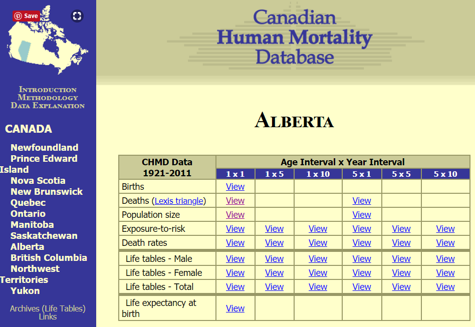
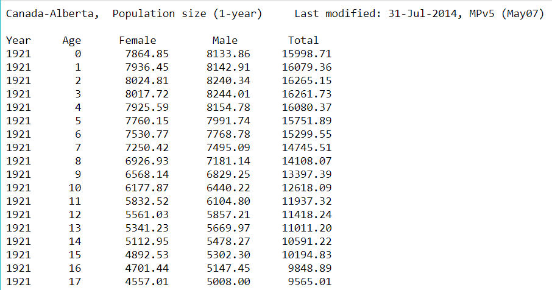
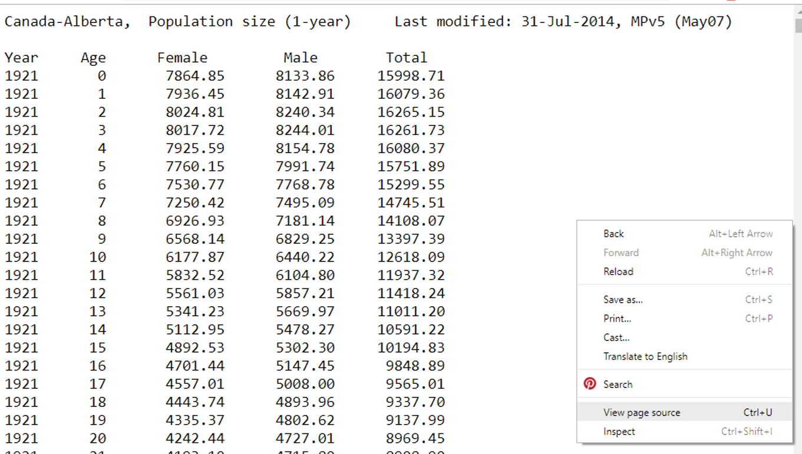

# web-scraping ASCII data

The purpose of web-scraping is to write scripts to download data from
online sources to avoid manual download operations, thereby enhancing
the project’s reproducibility.

The packages and functions we might use depend on the manner in which
the data is stored online, e.g., HTML, XML, or a text file with no XML
or HTML tags.

In this example, we have data sets comprised of rows of ASCII text with
no additional markup tags.

``` r
library(utils)
suppressPackageStartupMessages(library(tidyverse))
```

The sample data are from the Canadian human mortality database (Payeur,
Chouinard, & Bourbeau, [2011](#ref-canadianmortality)). If you select
one of the provinces in the left-hand margin (Alberta, in this example),
a table of links to data
appears.



<br>

Selecting the *Population size* link under the *1 x 1* column takes us
to a data page. While population counts would be expected to be
integers, the *Data Explanation* page explains that “Some of these
numbers are estimates (not actual counts), and therefore may be
expressed as
non-integers.”



<br>

While in this window, we can view the page source code underlying the
data table using Crtl-U (Windows) or right-clicking in the window to
bring up the menu shown. Select View page
source.



<br>

In this example, the page source shows no markup (no HTML tags). It is
an ASCII text file. Thus we can use `read.table()` from the utils
package.

## URL argument with `read.table()`

`read.table()` accepts a URL as the name of the file to be read
(Internet connection required).

From our glimpse of the data earlier, the first two rows are not data
and the third row contains the variable names.

``` r
url <- "http://www.prdh.umontreal.ca/BDLC/data/alb/Population.txt"
df  <- read.table(url, skip = 2, header = TRUE, stringsAsFactors = FALSE)

head(df)
##   Year Age  Female    Male    Total
## 1 1921   0 7864.85 8133.86 15998.71
## 2 1921   1 7936.45 8142.91 16079.36
## 3 1921   2 8024.81 8240.34 16265.15
## 4 1921   3 8017.72 8244.01 16261.73
## 5 1921   4 7925.59 8154.78 16080.37
## 6 1921   5 7760.15 7991.74 15751.89
```

For compatibility with later data tidying, we convert the data set to a
tibble.

``` r
df <- as_tibble(df)

df
## # A tibble: 10,212 x 5
##     Year Age   Female  Male  Total
##    <int> <chr>  <dbl> <dbl>  <dbl>
##  1  1921 0      7865. 8134. 15999.
##  2  1921 1      7936. 8143. 16079.
##  3  1921 2      8025. 8240. 16265.
##  4  1921 3      8018. 8244. 16262.
##  5  1921 4      7926. 8155. 16080.
##  6  1921 5      7760. 7992. 15752.
##  7  1921 6      7531. 7769. 15300.
##  8  1921 7      7250. 7495. 14746.
##  9  1921 8      6927. 7181. 14108.
## 10  1921 9      6568. 6829. 13397.
## # ... with 10,202 more rows
```

Age is a character because the of the “110+” entry.

``` r
unique(df$Age)
##   [1] "0"    "1"    "2"    "3"    "4"    "5"    "6"    "7"    "8"    "9"   
##  [11] "10"   "11"   "12"   "13"   "14"   "15"   "16"   "17"   "18"   "19"  
##  [21] "20"   "21"   "22"   "23"   "24"   "25"   "26"   "27"   "28"   "29"  
##  [31] "30"   "31"   "32"   "33"   "34"   "35"   "36"   "37"   "38"   "39"  
##  [41] "40"   "41"   "42"   "43"   "44"   "45"   "46"   "47"   "48"   "49"  
##  [51] "50"   "51"   "52"   "53"   "54"   "55"   "56"   "57"   "58"   "59"  
##  [61] "60"   "61"   "62"   "63"   "64"   "65"   "66"   "67"   "68"   "69"  
##  [71] "70"   "71"   "72"   "73"   "74"   "75"   "76"   "77"   "78"   "79"  
##  [81] "80"   "81"   "82"   "83"   "84"   "85"   "86"   "87"   "88"   "89"  
##  [91] "90"   "91"   "92"   "93"   "94"   "95"   "96"   "97"   "98"   "99"  
## [101] "100"  "101"  "102"  "103"  "104"  "105"  "106"  "107"  "108"  "109" 
## [111] "110+"
```

To change Age to a numeric value, we first remove the “+” but must
remember that the count represents all ages 110 or more.

``` r
df <- df %>% 
    mutate(Age = str_replace(Age, "\\+", "")) %>% 
    mutate(Age = as.numeric(Age))

glimpse(df)
## Observations: 10,212
## Variables: 5
## $ Year   <int> 1921, 1921, 1921, 1921, 1921, 1921, 1921, 1921, 1921, 1...
## $ Age    <dbl> 0, 1, 2, 3, 4, 5, 6, 7, 8, 9, 10, 11, 12, 13, 14, 15, 1...
## $ Female <dbl> 7864.85, 7936.45, 8024.81, 8017.72, 7925.59, 7760.15, 7...
## $ Male   <dbl> 8133.86, 8142.91, 8240.34, 8244.01, 8154.78, 7991.74, 7...
## $ Total  <dbl> 15998.71, 16079.36, 16265.15, 16261.73, 16080.37, 15751...
```

We can filter the tibble if we are interested in specific years, for
example,

``` r
df <- df %>% 
    filter(Year >= 1990 & Year <= 1999)

df
## # A tibble: 1,110 x 5
##     Year   Age Female   Male  Total
##    <int> <dbl>  <dbl>  <dbl>  <dbl>
##  1  1990     0 21053. 22086. 43138.
##  2  1990     1 20444. 21367. 41810.
##  3  1990     2 20176. 21140. 41316.
##  4  1990     3 20516  21483. 41999.
##  5  1990     4 20679. 21646. 42326.
##  6  1990     5 20308. 21401. 41710.
##  7  1990     6 20140. 21331. 41471.
##  8  1990     7 19793. 20844. 40637.
##  9  1990     8 19298. 20301. 39599.
## 10  1990     9 18724. 19816. 38540.
## # ... with 1,100 more rows
```

## automating the download for all provinces

In this example, the data for each Canadian province has a unique URL.
Examining the naming convention for the data URLs, we find that each is
named

    http://www.prdh.umontreal.ca/BDLC/data/abbr/Population.txt

where `abbr` is the abbreviation for the province. Thus, if we can
capture the abbreviations, we do not have to copy and paste all the
URLs. Here, I’ll use the first three provinces to illustrate the
process.

First, create a tibble row by row using `tribble()`. The abbreviations
are found manually from the website.

``` r
province_url <- tribble(
    ~province, ~abbr, 
    "Newfoundland", "nfl", 
    "Prince Edward Island", "pei", 
    "Nova Scotia", "nsc")

province_url
## # A tibble: 3 x 2
##   province             abbr 
##   <chr>                <chr>
## 1 Newfoundland         nfl  
## 2 Prince Edward Island pei  
## 3 Nova Scotia          nsc
```

Then create the URL string using the abbreviation,

``` r
province_url <- province_url %>% 
    mutate(url = str_c("http://www.prdh.umontreal.ca/BDLC/data/", abbr, "/Population.txt"))

province_url
## # A tibble: 3 x 3
##   province           abbr  url                                            
##   <chr>              <chr> <chr>                                          
## 1 Newfoundland       nfl   http://www.prdh.umontreal.ca/BDLC/data/nfl/Pop~
## 2 Prince Edward Isl~ pei   http://www.prdh.umontreal.ca/BDLC/data/pei/Pop~
## 3 Nova Scotia        nsc   http://www.prdh.umontreal.ca/BDLC/data/nsc/Pop~
```

Use a for loop to read each data set one at a time and bind it to the
collected data frame and add the province abbreviation to the data
frame. ( The loop could be vectorized using functions from the purrr
package. )

``` r
# empty df to collect 
collect_df <- tribble(
    ~Province, ~Year, ~Age, ~Female, ~Male, ~Total
    ) 

for (j in seq_along(province_url)){
    
    abbr <- province_url$abbr[j]
    url  <- province_url$url[j]
    df   <- read.table(url, skip = 2, header = TRUE, stringsAsFactors = FALSE)
    df   <- as_tibble(df) %>% 
        mutate(Province = abbr)

    collect_df <- bind_rows(collect_df, df)
    
}
```

Then apply the data tidying to the full data frame. I recomputed the
Total so it would be consistent with the rounded integer counts.

``` r
collect_df <- collect_df %>% 
    mutate(Age = str_replace(Age, "\\+", "")) %>% 
    mutate(Age = as.numeric(Age)) %>% 
    mutate(Female = round(Female, 0), 
           Male   = round(Male, 0), 
           Total  = Male + Female) %>% 
    filter(Year >= 1990 & Year <= 1999) 

glimpse(collect_df)
## Observations: 3,330
## Variables: 6
## $ Province <chr> "nfl", "nfl", "nfl", "nfl", "nfl", "nfl", "nfl", "nfl...
## $ Year     <int> 1990, 1990, 1990, 1990, 1990, 1990, 1990, 1990, 1990,...
## $ Age      <dbl> 0, 1, 2, 3, 4, 5, 6, 7, 8, 9, 10, 11, 12, 13, 14, 15,...
## $ Female   <dbl> 3702, 3617, 3737, 3910, 4097, 4169, 4266, 4404, 4544,...
## $ Male     <dbl> 3911, 3782, 3847, 3994, 4221, 4396, 4515, 4559, 4570,...
## $ Total    <dbl> 7613, 7399, 7584, 7904, 8318, 8565, 8781, 8963, 9114,...
```

Use `complete()` to create explicit NAs for any missing observations by
province, year, and age.

``` r
df <- df %>% 
  complete(Province, Year, Age)
```

Check for NA in each column

``` r
# apply to columns (MARGIN = 2)
apply(df, MARGIN = 2, function(x) any(is.na(x)))
## Province     Year      Age   Female     Male    Total 
##    FALSE    FALSE    FALSE    FALSE    FALSE    FALSE
```

Examine the result

``` r
head(collect_df)
## # A tibble: 6 x 6
##   Province  Year   Age Female  Male Total
##   <chr>    <int> <dbl>  <dbl> <dbl> <dbl>
## 1 nfl       1990     0   3702  3911  7613
## 2 nfl       1990     1   3617  3782  7399
## 3 nfl       1990     2   3737  3847  7584
## 4 nfl       1990     3   3910  3994  7904
## 5 nfl       1990     4   4097  4221  8318
## 6 nfl       1990     5   4169  4396  8565

tail(collect_df)
## # A tibble: 6 x 6
##   Province  Year   Age Female  Male Total
##   <chr>    <int> <dbl>  <dbl> <dbl> <dbl>
## 1 nsc       1999   105      6     1     7
## 2 nsc       1999   106      4     0     4
## 3 nsc       1999   107      0     0     0
## 4 nsc       1999   108      2     0     2
## 5 nsc       1999   109      1     0     1
## 6 nsc       1999   110      0     0     0

glimpse(collect_df)
## Observations: 3,330
## Variables: 6
## $ Province <chr> "nfl", "nfl", "nfl", "nfl", "nfl", "nfl", "nfl", "nfl...
## $ Year     <int> 1990, 1990, 1990, 1990, 1990, 1990, 1990, 1990, 1990,...
## $ Age      <dbl> 0, 1, 2, 3, 4, 5, 6, 7, 8, 9, 10, 11, 12, 13, 14, 15,...
## $ Female   <dbl> 3702, 3617, 3737, 3910, 4097, 4169, 4266, 4404, 4544,...
## $ Male     <dbl> 3911, 3782, 3847, 3994, 4221, 4396, 4515, 4559, 4570,...
## $ Total    <dbl> 7613, 7399, 7584, 7904, 8318, 8565, 8781, 8963, 9114,...
```

With 111 age groups, 10 years, and three provinces, the number of rows
is correct.

## references

<div id="refs" class="references">

<div id="ref-canadianmortality">

Payeur, F. F., Chouinard, P., & Bourbeau, R. (2011). Canadian Human
Mortality Database. Retrieved October 30, 2018, from
<http://www.bdlc.umontreal.ca/chmd/index.htm>

</div>

</div>
