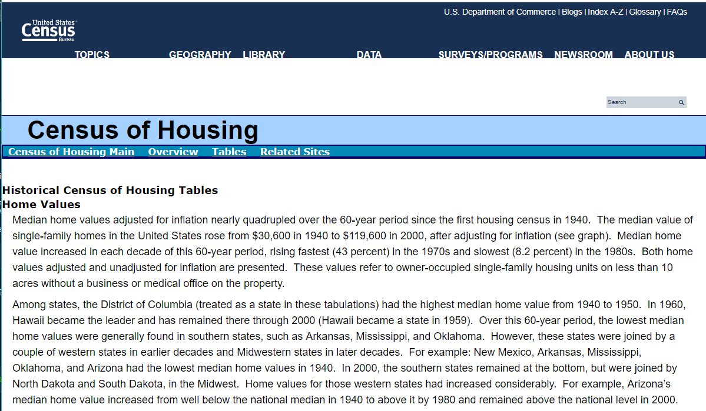
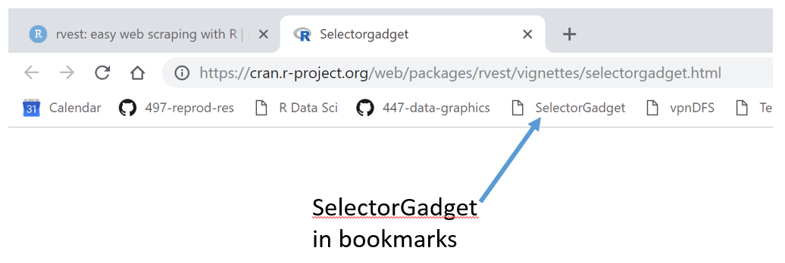

---
output: github_document
bibliography: "../resources/bib-etc/references-rr.bib"
csl: "../resources/styles/apa.csl"
link-citations: yes
--- 

# web-scraping HTML data

```{r include = FALSE}
library(knitr)
opts_knit$set(root.dir = "../")
opts_chunk$set(fig.width = 6, fig.asp = 1/1.6, out.width = "70%", fig.align = "center", collapse = TRUE)
```

The purpose of web-scraping is to write scripts to download data from online sources to avoid manual download operations, thereby enhancing the project's reproducibility. 

The packages and functions we might  use depend on the manner in which the data is stored online, e.g., HTML, XML, or a text file with no XML or HTML tags. 

In this example, we have data sets encoded online in HTML markup. The data are median values of US [home prices](https://www.census.gov/hhes/www/housing/census/historic/values.html) by state for several decades from the US Census

```{r echo=FALSE}

```


## getting started 

The basic methodology is adapted from an RStudio [blog post](https://blog.rstudio.com/2014/11/24/rvest-easy-web-scraping-with-r/). For webscraping we use the **rvest** package (which also loads required package **xml2**). 

```{r}
suppressPackageStartupMessages(library(rvest))
suppressPackageStartupMessages(library(tidyverse))
```

*SelectorGadget* is a java script bookmarklet that allows you to interactively figure out what markup tags (called CSS "selectors") you need to extract desired components from a page. To set it up, 

- Navigate to the [SelectorGadget](https://cran.r-project.org/web/packages/rvest/vignettes/selectorgadget.html) site 
- In *Installation*, drag the SelectorGadget link to your browser bookmarks bar. 


```{r echo=FALSE}

```


## work with the HTML page

`read_html()` is a function in **xml2**. The argument is the URL of the online data set, in this case, https://www.census.gov/hhes/www/housing/census/historic/values.html. 

```{r}
webdata <- read_html("https://www.census.gov/hhes/www/housing/census/historic/values.html")

webdata
```

To use *SelectorGadget* interactively, open your browser and:  


- Navigate to the data URL, in this case,  https://www.census.gov/hhes/www/housing/census/historic/values.html
- In this window, click on the selector gadget in the browser bookmarks 
- Move down to the data and click 
- In the window at the bottom of the page, the selector appears 
- For selecting more than one or toggling selections on and off, see the detailed tutorial at the [SelectorGadget vignette](https://cran.r-project.org/web/packages/rvest/vignettes/selectorgadget.html). 


In this case the selector is `pre`. 


## use the CSS selector

The CSS selector is the argument for  `html_nodes()`. 

```{r}
webdata <- webdata %>%
  html_nodes("pre")

webdata
```

## data transformation 

First we convert the webdata object to a single text string using `rvest::html_text()`. 

```{r}
webdata <- webdata %>%
	html_text()

str(webdata)
```


The string includes newline tags (`\n`) that we can use to separate the one long string into a vector of strings. 


```{r}
webdata <- webdata %>%
  str_split("\n")

str(webdata)
```

Prior to the split we had one character string. After the split, the structure shows 129 rows (`chr [1:129]`). 

The current vector is a list. Use `unlist()` to convert it to a simple vector. 
```{r}
webdata <- unlist(webdata)

webdata
```

This vector of strings is ready for tidying. 

## tidy the data

These data are not tidy: years are spread across as column headings. Extract the year data from its row. Use these to create the eventual column names of the tibble to come. 

```{r}
year_row <- which(str_detect(webdata, "2000"))[1]
year_row     <- str_squish(webdata[year_row])
year_row

year_row <- unlist(str_split(year_row, " "))
year_row
```

This data set has two major chunks: the upper chunk in constant dollars (adjusted for inflation) and the lower chunk in nominal dollars (not adjusted for inflation). Comparisons should always be made in constant dollars, so we need only the top chunk. 

The division between the two chunks is labeled "Median Home Values: Unadjusted". Find the row number of this string and filter to keep the rows above that row. 

```{r}
unadjusted_row <- which(str_detect(webdata, "Unadjusted"))
unadjusted_row

webdata <- webdata[1:(unadjusted_row-1)]
head(webdata, n = 12L)
```

Keep only those rows that include the names of the states.

```{r}
state_names <- state.name
state_names <- str_c(state_names, collapse = "|")
state_names

keep_rows   <- which(str_detect(webdata, state_names))
keep_rows

webdata <- webdata[keep_rows]
head(webdata, n = 12L)
```

I think I would like to split the strings on the dollar signs, but to do that, I'll need the NA to be replaced with "$NA". 

```{r}
webdata <- str_replace(webdata, "NA",  "$NA")
head(webdata, n = 12L)
```

I think I need to omit the extra spaces

```{r}
webdata <- str_squish(webdata)
head(webdata, n = 12L)
```

For further tidying, convert the vector to a tibble.

```{r}
df <- webdata %>%
  as_tibble(headings = FALSE)

colnames(df) <- "state"

head(df, n = 12L)
```

Try splitting the columns on the dollar sign. 

```{r}
df <- df %>% 
	separate(col = state, into = c("state", year_row), sep = "[$]")
glimpse(df)
```

Gather the years, trim the strings, convert years to an integer

```{r}
df <- df %>% 
	gather(year, price, '2000':'1940') %>% 
	mutate(year = as.integer(year)) %>% 
	mutate(state = str_trim(state)) %>% 
	mutate(price = str_trim(price)) %>% 
	arrange(year, state) %>% 
	glimpse()
```

To  convert price to numerical values, I have to  remove the comma and NA values. 

```{r}
df <- df %>%
  mutate(price = str_replace(price, ",", "")) %>% 
	filter(price != "NA") %>% 
	mutate(price = as.integer(price)) %>% 
	glimpse()
```

To ensure that missing values are explicit, use `complete()` to re-insert explicit NAs. 

```{r}
df <- df %>% 
	complete(state, year) %>% 
	arrange(year, state) %>% 
	glimpse()
```

These data are tidy

## conclusion

This data frame can be written to file 

    write_csv(df, "data/house_price.csv")

or to an RDS data file, 

    saveRDS(df, "data/house_price.rds")

By limiting the scope of this script to data acquisition and tidying, we write the entire data frame to file.


## the next script 

We would generally start any additional subsetting of the data to the next script. We start by reading the CSV file,  

    df <- read_csv("data/house_price.csv")

or the RDS file, 

    df <- readRDS("data/house_price.rds")

This is the point at which we would filter by year if, for example, the analysis was focused on a specific year. 

```{r}
df <- df %>% 
	filter(year == 2000) %>% 
	glimpse
```

