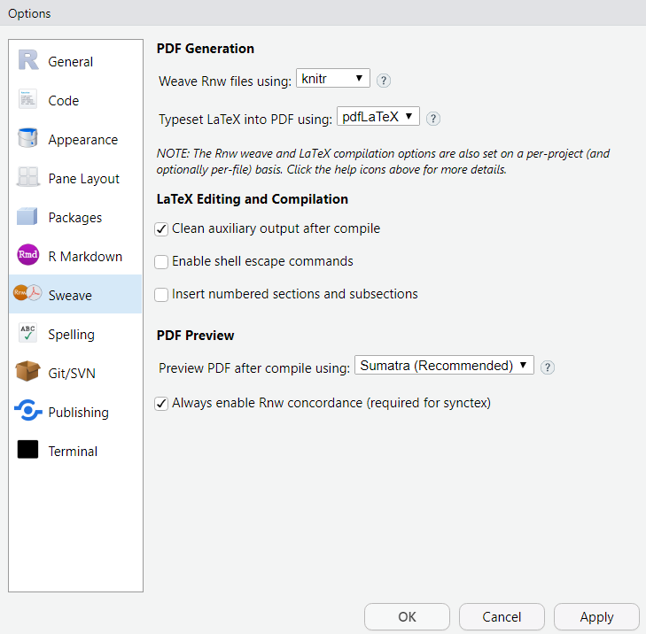
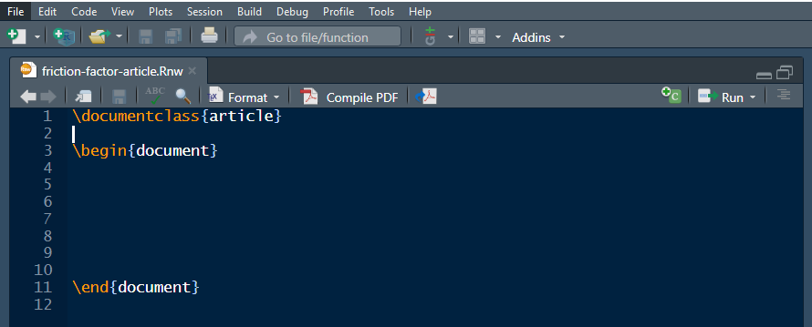
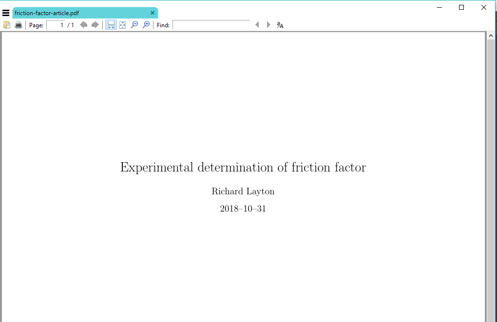
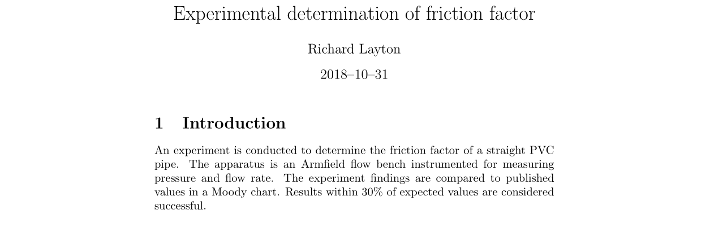

---
output: github_document
bibliography: "../resources/bib-etc/references-rr.bib"
csl: "../resources/styles/apa.csl"
link-citations: yes
--- 

# beyond Rmd

```{r include = FALSE}
library(knitr)
opts_knit$set(root.dir = "../")
opts_chunk$set(fig.width = 6, fig.asp = 1/1.6, out.width = "100%", fig.align = "center", collapse = TRUE, echo = FALSE)
```


R Markdown is a versatile tool for making your work reproducible. However, if your final document design requires 

- extreme attention paid to document design details 
- distribution as printed pages 
- a reproducible workflow 

then you may want to consider using the LaTeX markup language instead of R Markdown. 

In RStudio, we write LaTeX markup in an Rnw file. When knitted, the Rnw file creates a PDF output document. 


## getting started 

LaTeX must be installed on your machine for use Rnw files. See the installation instructions on the [LaTeX](https://www.latex-project.org/get/) project page. For Windows machines, I suggest the MiKTeX installation.

I also recommend the [Sumatra PDF](https://www.sumatrapdfreader.org/free-pdf-reader.html) as the default software for viewing the output documents because, unlike Adobe Acrobat, Sumatra allows knitted documents to update without closing the open file. 

In RStudio **Tools | Global Options | Sweave**, set 

- Weave Rnw files using **knitr** 
- Typeset LaTeX into PDF using **pdfLaTeX** (unless you need XeLaTeX) 
- `r "\U2714"` Clean auxiliary output 
- Preview PDF using **Sumatra** 

```{r}

```


## Rnw? Sweave?   

Rnw stands for R no-WEB.

- When Donald Knuth first implemented "literate programming" (embedding prose and code in the same script) he used a computer programming system called "WEB" (no relationship to the world-wide-web). 
- WEB included a program called WEAVE to combine prose and code in the output document. A version of weave was created for the S language (a commercial forerunner of R) called Sweave. 
- The Sweave implementation for R does not rely WEB, hence the name R no-WEB, or Rnw.  


Today, many of us now use knitr instead of Sweave. But now you know why the RStudio menu chain for opening an Rnw file is  **File | New File | R Sweave**. 


## start an Rnw file 

In RStudio **File | New File | R Sweave** creates an Untitled file. Save the file (I used the filename `friction-factor-article`) and Rstudio appends the Rnw extension. 


```{r}

```

<br>

The default file opens with three markups required for every Rnw document. 

- Every Rnw file starts with a `\documentclass{}` declaration. 
- The area between `\documentclass{}` and `\begin{document}` is the preamble---a region for loading LaTeX packages and setting parameters.   
- After the preamble, the text and code chunks of your document begin with `\begin{document}`. 
- The last line of the document is `\end{document}`. 


## start the sample report

Add the following lines and save. `%` denotes a comment 

- Add the title, author, and date commands in the preamble  
- After `\begin{document}`, add the maketitle command 
 

```
\documentclass{article}

% preamble
\title{Experimental determination of friction factor}
\author{Richard Layton}
\date{2018--10--31}

\begin{document}
\maketitle{}


\end{document}
```

Knit the document to obtain the output PDF:

```{r}

```


## common markup structures

Markup commands start with a backslash and the arguments are enclosed in curly braces, for example,  

- `\section{}` is the markup to start a first-level heading 
- `\subsection{}` is a second-level heading 
- `\begin{figure}` and `\end{figure}` delimit figures to be auto-numbered 
- `\begin{equation}` and `\end{equation}` delimit equations to be auto-numbered 
- `\begin{itemize}` and `\end{itemize}` delimit bulleted lists 
- `\begin{enumerate}` and `\end{enumerate}` delimit numbered lists 
- `\textit{}` for italics  
- `\textbf{}` for bold 
- `\texttt()` for typewriter font 


## start a new section

The Introduction begins with the section markup

```
\section{Introduction}
```

followed by the prose. 

```
An experiment is conducted to determine ...

```

Knitting the document produces


```{r}

```


 


## references
