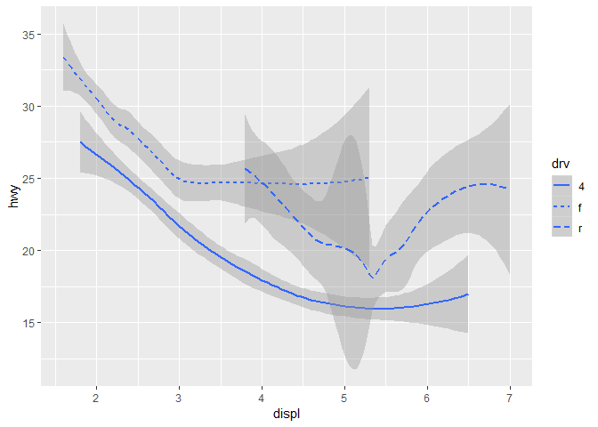

# Geoms

Richard Layton  
2018-09-06

``` r
library(knitr)
opts_knit$set(root.dir = "../")
opts_chunk$set(echo=TRUE, collapse=TRUE)
```

## 3.6

``` r
library(tidyverse)
## -- Attaching packages ---------------------------------- tidyverse 1.2.1 --
## v ggplot2 3.0.0.9000     v purrr   0.2.5     
## v tibble  1.4.2          v dplyr   0.7.6     
## v tidyr   0.8.1          v stringr 1.3.1     
## v readr   1.1.1          v forcats 0.3.0
## -- Conflicts ------------------------------------- tidyverse_conflicts() --
## x dplyr::filter() masks stats::filter()
## x dplyr::lag()    masks stats::lag()
```

using `geom_point()`

``` r
ggplot(data = mpg) + 
  geom_point(mapping = aes(x = displ, y = hwy))
```

<!-- -->

using `geom_smooth()`

``` r
ggplot(data = mpg) + 
  geom_smooth(mapping = aes(x = displ, y = hwy))
## `geom_smooth()` using method = 'loess' and formula 'y ~ x'
```

<!-- -->

``` r
ggplot(data = mpg) + 
  geom_smooth(mapping = aes(x = displ, y = hwy, linetype = drv))
## `geom_smooth()` using method = 'loess' and formula 'y ~ x'
```

<!-- -->
