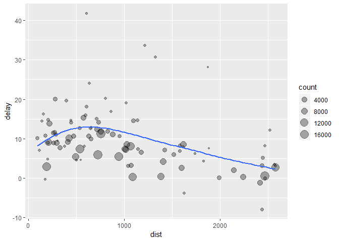

``` r
suppressPackageStartupMessages(library(tidyverse))
library(nycflights13)
```

## 5.6 summarise

``` r
library(nycflights13)
library(tidyverse)
glimpse(flights)
## Observations: 336,776
## Variables: 19
## $ year           <int> 2013, 2013, 2013, 2013, 2013, 2013, 2013, 2013,...
## $ month          <int> 1, 1, 1, 1, 1, 1, 1, 1, 1, 1, 1, 1, 1, 1, 1, 1,...
## $ day            <int> 1, 1, 1, 1, 1, 1, 1, 1, 1, 1, 1, 1, 1, 1, 1, 1,...
## $ dep_time       <int> 517, 533, 542, 544, 554, 554, 555, 557, 557, 55...
## $ sched_dep_time <int> 515, 529, 540, 545, 600, 558, 600, 600, 600, 60...
## $ dep_delay      <dbl> 2, 4, 2, -1, -6, -4, -5, -3, -3, -2, -2, -2, -2...
## $ arr_time       <int> 830, 850, 923, 1004, 812, 740, 913, 709, 838, 7...
## $ sched_arr_time <int> 819, 830, 850, 1022, 837, 728, 854, 723, 846, 7...
## $ arr_delay      <dbl> 11, 20, 33, -18, -25, 12, 19, -14, -8, 8, -2, -...
## $ carrier        <chr> "UA", "UA", "AA", "B6", "DL", "UA", "B6", "EV",...
## $ flight         <int> 1545, 1714, 1141, 725, 461, 1696, 507, 5708, 79...
## $ tailnum        <chr> "N14228", "N24211", "N619AA", "N804JB", "N668DN...
## $ origin         <chr> "EWR", "LGA", "JFK", "JFK", "LGA", "EWR", "EWR"...
## $ dest           <chr> "IAH", "IAH", "MIA", "BQN", "ATL", "ORD", "FLL"...
## $ air_time       <dbl> 227, 227, 160, 183, 116, 150, 158, 53, 140, 138...
## $ distance       <dbl> 1400, 1416, 1089, 1576, 762, 719, 1065, 229, 94...
## $ hour           <dbl> 5, 5, 5, 5, 6, 5, 6, 6, 6, 6, 6, 6, 6, 6, 6, 5,...
## $ minute         <dbl> 15, 29, 40, 45, 0, 58, 0, 0, 0, 0, 0, 0, 0, 0, ...
## $ time_hour      <dttm> 2013-01-01 05:00:00, 2013-01-01 05:00:00, 2013...
```

``` r
df <- flights %>%
    summarise(delay = mean(dep_delay, na.rm = TRUE))
glimpse(df)
## Observations: 1
## Variables: 1
## $ delay <dbl> 12.63907
```

`summarise()` is not terribly useful unless we pair it with `group_by()`

``` r
this_group <- group_by(flights, year, month, day)
df <- summarise(this_group
                                , delay = mean(dep_delay, na.rm = TRUE)
                                , count = n()
                                )

glimpse(df)
## Observations: 365
## Variables: 5
## $ year  <int> 2013, 2013, 2013, 2013, 2013, 2013, 2013, 2013, 2013, 20...
## $ month <int> 1, 1, 1, 1, 1, 1, 1, 1, 1, 1, 1, 1, 1, 1, 1, 1, 1, 1, 1,...
## $ day   <int> 1, 2, 3, 4, 5, 6, 7, 8, 9, 10, 11, 12, 13, 14, 15, 16, 1...
## $ delay <dbl> 11.548926, 13.858824, 10.987832, 8.951595, 5.732218, 7.1...
## $ count <int> 842, 943, 914, 915, 720, 832, 933, 899, 902, 932, 930, 6...
```

``` r
delays <- flights %>% 
  group_by(dest) %>% 
  summarise(
    count = n(),
    dist = mean(distance, na.rm = TRUE),
    delay = mean(arr_delay, na.rm = TRUE)
  ) %>% 
    ungroup() %>%
  filter(count > 20, dest != "HNL")
```

``` r
ggplot(data = delays, mapping = aes(x = dist, y = delay)) +
  geom_point(aes(size = count), alpha = 1/3) +
  geom_smooth(se = FALSE)
## `geom_smooth()` using method = 'loess' and formula 'y ~ x'
```

<!-- -->
