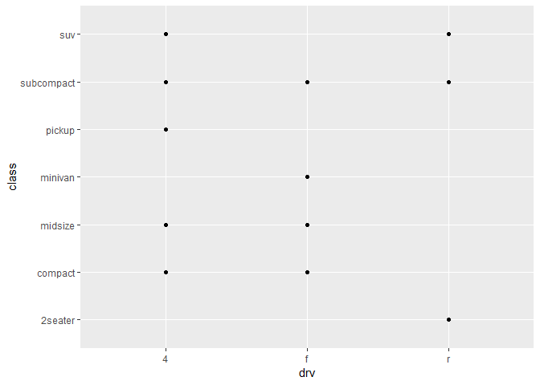

# Ch 1 examples and exercises

## examples

Load the tidyverse packages

``` r
library(tidyverse)
## -- Attaching packages ---------------------------------------------------------------- tidyverse 1.2.1 --
## v ggplot2 3.0.0.9000     v purrr   0.2.5     
## v tibble  1.4.2          v dplyr   0.7.6     
## v tidyr   0.8.1          v stringr 1.3.1     
## v readr   1.1.1          v forcats 0.3.0
## -- Conflicts ------------------------------------------------------------------- tidyverse_conflicts() --
## x dplyr::filter() masks stats::filter()
## x dplyr::lag()    masks stats::lag()
```

Examine the `mpg` data set

``` r
mpg
## # A tibble: 234 x 11
##    manufacturer model displ  year   cyl trans drv     cty   hwy fl    cla~
##    <chr>        <chr> <dbl> <int> <int> <chr> <chr> <int> <int> <chr> <ch>
##  1 audi         a4      1.8  1999     4 auto~ f        18    29 p     com~
##  2 audi         a4      1.8  1999     4 manu~ f        21    29 p     com~
##  3 audi         a4      2    2008     4 manu~ f        20    31 p     com~
##  4 audi         a4      2    2008     4 auto~ f        21    30 p     com~
##  5 audi         a4      2.8  1999     6 auto~ f        16    26 p     com~
##  6 audi         a4      2.8  1999     6 manu~ f        18    26 p     com~
##  7 audi         a4      3.1  2008     6 auto~ f        18    27 p     com~
##  8 audi         a4 q~   1.8  1999     4 manu~ 4        18    26 p     com~
##  9 audi         a4 q~   1.8  1999     4 auto~ 4        16    25 p     com~
## 10 audi         a4 q~   2    2008     4 manu~ 4        20    28 p     com~
## # ... with 224 more rows
```

First graph

``` r
ggplot(data = mpg) +
    geom_point(mapping = aes(x = displ, y = hwy))
```

<!-- -->

## exercises, p.6

1.  Produces an empty graph because no geometric object has been
    specified.

<!-- end list -->

``` r
ggplot(data = mpg)
```

<!-- -->

2.  Rows and columns in `mpg` from the output below 234 rows, 11
    columns.

<!-- end list -->

``` r
mpg
## # A tibble: 234 x 11
##    manufacturer model displ  year   cyl trans drv     cty   hwy fl    cla~
##    <chr>        <chr> <dbl> <int> <int> <chr> <chr> <int> <int> <chr> <ch>
##  1 audi         a4      1.8  1999     4 auto~ f        18    29 p     com~
##  2 audi         a4      1.8  1999     4 manu~ f        21    29 p     com~
##  3 audi         a4      2    2008     4 manu~ f        20    31 p     com~
##  4 audi         a4      2    2008     4 auto~ f        21    30 p     com~
##  5 audi         a4      2.8  1999     6 auto~ f        16    26 p     com~
##  6 audi         a4      2.8  1999     6 manu~ f        18    26 p     com~
##  7 audi         a4      3.1  2008     6 auto~ f        18    27 p     com~
##  8 audi         a4 q~   1.8  1999     4 manu~ 4        18    26 p     com~
##  9 audi         a4 q~   1.8  1999     4 auto~ 4        16    25 p     com~
## 10 audi         a4 q~   2    2008     4 manu~ 4        20    28 p     com~
## # ... with 224 more rows
```

3.  What does the drv variable describe? Read the help for ?mpg to find
    out.

<!-- end list -->

  - f = front-wheel drive
  - r = rear wheel drive
  - 4 = 4wd

<!-- end list -->

4.  Make a scatterplot of hwy vs cyl.

<!-- end list -->

``` r
ggplot(data = mpg) +
    geom_point(mapping = aes(x = cyl, y = hwy))
```

<!-- -->

5.  What happens if you make a scatterplot of class vs drv? Why is the
    plot not useful?

<!-- end list -->

``` r
ggplot(data = mpg) +
    geom_point(mapping = aes(x = drv, y = class))
```

<!-- -->

The plot is not particularly useful because class is generally
independent of drive type, so no correlation between the two variables
is seen.
